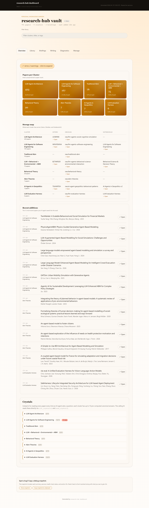

# research-hub

> **Build your research cluster once. Ask AI about it thousands of times.**
> Zotero + Obsidian + NotebookLM, wired together for AI agents.

[](https://pypi.org/project/research-hub-pipeline/)
[](docs/audit_v0.45.md)
[](pyproject.toml)
[](LICENSE)
[](.github/workflows/ci.yml)

繁體中文說明 → [README.zh-TW.md](README.zh-TW.md)



---

## Install (under 60 seconds)

```bash
pip install research-hub-pipeline[playwright,secrets]
research-hub init                 # interactive: pick persona + Zotero/NLM
research-hub notebooklm login     # one-time Google sign-in for NotebookLM
```

Python 3.10+. Optional `npm install -g defuddle-cli` for cleaner URL imports.

---

## The 1-minute story (v0.46 lazy mode)

```bash
research-hub auto "harness engineering for LLM agents"
```

That single command:
1. Slugifies the topic into a cluster
2. Searches arXiv + Semantic Scholar (8 papers default)
3. Ingests them into Zotero + Obsidian
4. Bundles + uploads to NotebookLM
5. Generates + downloads a brief into `.research_hub/artifacts/<slug>/`

~50 seconds end-to-end. No prompt engineering. No copy-paste between systems.

The 4 lazy commands you actually need ([full guide](docs/lazy-mode.md)):

```bash
research-hub auto "topic"                # find + save + brief in one command
research-hub ask  "question" --cluster X  # ad-hoc Q&A against an uploaded notebook
research-hub tidy                         # one-shot maintenance: doctor + dedup + bases + cleanup preview
research-hub cleanup --all --apply        # GC bundles + debug logs + old artifacts
```

Or click them as buttons in `research-hub serve --dashboard` → Manage tab ([dashboard walkthrough](docs/dashboard-walkthrough.md)).

---

## The longhand version (when you want control)

If you want to inspect each step, the same flow expanded:

```bash
research-hub clusters new --query "LLM evaluation harness" --slug llm-evaluation-harness
research-hub search "language model evaluation harness" --to-papers-input \
    --cluster llm-evaluation-harness > papers.json
research-hub ingest --cluster llm-evaluation-harness --no-verify

research-hub notebooklm bundle   --cluster llm-evaluation-harness
research-hub notebooklm upload   --cluster llm-evaluation-harness   # patchright + persistent Chrome, no API key
research-hub notebooklm generate --cluster llm-evaluation-harness --type brief
research-hub notebooklm download --cluster llm-evaluation-harness --type brief

research-hub notebooklm ask --cluster llm-evaluation-harness \
    --question "What are the 3 main research threads?"
```

Your vault now has `.research_hub/artifacts/llm-evaluation-harness/brief-*.txt` — a synthesis of all uploaded papers, generated by NotebookLM (no API key needed — patchright drives your local Chrome).

2 more minutes: generate the AI summary layer (**crystals**) and the structured entity/claim registry (**memory**):

```bash
research-hub crystal emit --cluster llm-evaluation-harness > prompt.md
# (paste prompt to Claude/GPT, save response as crystals.json)
research-hub crystal apply --cluster llm-evaluation-harness --scored crystals.json

research-hub memory emit  --cluster llm-evaluation-harness > mem-prompt.md
research-hub memory apply --cluster llm-evaluation-harness --scored memory.json
```

Now open Claude Desktop and ask:

> **You:** "What's the current SOTA in LLM evaluation harness?"
> **Claude (via MCP):** calls `read_crystal("llm-evaluation-harness", "sota-and-open-problems")` → gets a pre-written 180-word answer with paper citations. **~1 KB read, 0 abstracts fetched at query time.**

That pre-written answer is a **crystal**. You paid the reasoning cost once; every subsequent question is ~1 KB of cached analysis. See [`hub/llm-evaluation-harness/crystals/`](hub/llm-evaluation-harness/crystals/) in your vault for the 10 canonical Q&As generated above.

---

## What makes it different

### 1. Pre-computed answers, not lazy retrieval

Every RAG system still assembles context at query time. research-hub's answer: **store the AI's reasoning, not the inputs**.

For each cluster you generate ~10 canonical Q→A **crystals** once with any LLM. Later queries read a pre-written paragraph (~1 KB), not 20 paper abstracts (~30 KB) — **30× compression** with quality that doesn't degrade at query time. Underneath, a structured **memory layer** holds the entities, typed claims with confidence, and method taxonomies that crystals reference. AI agents query via `list_entities`, `list_claims(min_confidence="high")`, `list_methods` — no RAG over prose, structured lookup over structured data.

Example cluster: [`hub/llm-evaluation-harness/`](hub/llm-evaluation-harness/) has 10 crystals + 14 entities + 12 claims + 7 methods, all generated once. [→ Why this is not RAG](docs/anti-rag.md)

### 2. Live dashboard, 4 personas, direct execution

```bash
research-hub serve --dashboard      # http://127.0.0.1:8765/
```

Same vault, 4 rendered dashboards (researcher / humanities / analyst / internal-KM) — vocabulary and hidden tabs adapt per persona. Six tabs: Overview, Library, Briefings, Writing, Diagnostics, Manage. Every Manage-tab button **directly executes** the CLI — no copy-paste. Diagnostics groups identical alerts (e.g. 36 Zotero orphans → one card with `×36` badge), so noise stays low even on a multi-thousand-paper vault.

[→ Dashboard walkthrough](docs/dashboard-walkthrough.md) · [→ Persona screenshots](docs/personas.md) · [→ First 10 minutes](docs/first-10-minutes.md)

### 3. Cluster integrity + lazy-mode maintenance

Papers drift, rebind v2 catches it. On the maintainer's 1063-orphan vault: 33% → **100% coverage** via an 8-heuristic chain + auto-create-from-folder proposals. For day-to-day upkeep, four lazy commands take over:

```bash
research-hub auto "harness engineering for LLM agents"   # search → ingest → NLM brief, ~50s
research-hub tidy                                        # doctor + dedup + bases + cleanup preview
research-hub clean --all --apply                         # GC stale bundles / debug logs / artifacts
research-hub ask llm-evaluation-harness "what's SOTA?"   # cached crystal answer (~1 KB)
```

All four are also exposed as MCP tools in v0.47 — talk to Claude Desktop, no shell needed. [→ Lazy mode reference](docs/lazy-mode.md) · [→ Cluster integrity matrix](docs/cluster-integrity.md)

---

## Install

```bash
# Researcher / Humanities (use Zotero + NotebookLM)
pip install research-hub-pipeline[playwright,secrets]

# Analyst / Internal KM (no Zotero, import local files)
pip install research-hub-pipeline[import,secrets]

research-hub init              # 4-option interactive persona prompt
research-hub serve --dashboard # opens browser
```

Python 3.10+. **No OpenAI/Anthropic API key required** — research-hub is provider-agnostic (all AI generation uses emit/apply pattern; you feed prompts to your own AI).

## For Claude Code / Claude Desktop users

Add to `claude_desktop_config.json`:

```json
{
  "mcpServers": {
    "research-hub": {
      "command": "research-hub",
      "args": ["serve"]
    }
  }
}
```

**78 MCP tools** cover: paper ingest, cluster CRUD, labels, quotes, draft composition, citation graph, NotebookLM (upload/generate/download/**ask**), crystal generation, fit-check, autofill, cluster memory, cluster rebind workflows, **Obsidian Bases dashboard generation** (`emit_cluster_base`).

Then talk to Claude:

> "Claude, what's in my llm-evaluation-harness cluster?" → `read_crystal("what-is-this-field")` → 180-word answer
> "Claude, which claims have high confidence?" → `list_claims(cluster="llm-evaluation-harness", min_confidence="high")` → 10 structured claims with paper refs
> "Claude, add arxiv 2310.06770 to LLM-SE cluster" → `add_paper(...)` → Zotero + Obsidian + NotebookLM entries

---

## Status

- **Latest**: v0.45.0 (2026-04-19) — see [`CHANGELOG.md`](CHANGELOG.md)
- **Tests**: 1520 passing, 15 skipped, 2 xfailed (CI: Linux + Windows + macOS × Python 3.10/3.11/3.12)
- **Platforms**: Windows, macOS, Linux
- **Python**: 3.10+
- **Dependencies**: `pyzotero`, `pyyaml`, `requests`, `rapidfuzz`, `networkx`, `platformdirs` (all pure-Python)
- **Optional**: `playwright` extra for NotebookLM browser automation

## Architecture docs

- [Your first 10 minutes](docs/first-10-minutes.md) — guided tour for each of the 4 personas
- [User personas](docs/personas.md) — 4 persona profiles with per-persona feature matrix
- [Cluster integrity](docs/cluster-integrity.md) — 6 failure modes + mitigation matrix across all 4 personas
- [MCP tools reference](docs/mcp-tools.md) — all 60 tools categorized + signatures
- [Example Claude Desktop flow](docs/example-claude-mcp-flow.md) — worked example: ingest → crystallize → query
- [Import folder](docs/import-folder.md) — local file ingest for analyst persona (PDF/DOCX/MD/TXT/URL)
- [Anti-RAG crystals](docs/anti-rag.md) — why pre-computed Q→A beats retrieval
- [Upgrade guide](UPGRADE.md) — migrating from older versions
- [Task-level workflows](docs/task-workflows.md) — v0.33+ 5 MCP wrappers (ask/brief/sync/compose/collect)
- [Screenshot workflow](docs/screenshot-workflow.md) — re-render any dashboard tab
- [Audit reports](docs/) — `audit_v0.26.md` … `audit_v0.45.md`
- [NotebookLM setup](docs/notebooklm.md) + [troubleshooting](docs/notebooklm-troubleshooting.md) — patchright + persistent Chrome (v0.42+)
- [Dashboard walkthrough](docs/dashboard-walkthrough.md) — tab-by-tab tour with persona-specific recipes (v0.44)
- [Validation log v0.43](docs/validation_v0.43.md) — 11-paper NotebookLM stress test + dual-backend ask cross-check
- [Papers input schema](docs/papers_input_schema.md) — ingestion pipeline reference

## Workflow reference

| Stage | Command | What it does |
|---|---|---|
| **Init** | `init` / `doctor` | First-time config + health check (doctor has 12+ checks, `--autofix` for mechanical backfills) |
| **Find** | `search` / `verify` / `discover new` | Multi-backend paper search + DOI resolution + AI-scored discovery |
| **Ingest** | `add` / `ingest` / `import-folder` | One-shot or bulk paper ingest into Zotero + Obsidian |
| **Organize** | `clusters new/list/show/bind/merge/split/rename/delete/rebind/scaffold-missing` | Cluster CRUD + 8-heuristic rebind + hub scaffolding |
| **Topic** | `topic scaffold/propose/assign/build` | Sub-topic notes from `subtopics:` frontmatter |
| **Label** | `label` / `find --label` / `paper prune` / `paper lookup-doi` | Canonical label vocabulary + Crossref DOI backfill |
| **Crystal** | `crystal emit/apply/list/read/check` | Pre-computed canonical Q→A answers |
| **Memory** | `memory emit/apply/list/read` | Structured entities/claims/methods registry |
| **Analyze** | `clusters analyze --split-suggestion` | Citation-graph community detection for big clusters |
| **Sync** | `sync status` / `pipeline repair` | Detect + repair Zotero ↔ Obsidian drift |
| **Dashboard** | `dashboard` / `serve --dashboard` / `vault graph-colors` | Static HTML or live HTTP server (v0.44 Manage tab buttons drive the v0.42/v0.43 actions below) |
| **NotebookLM** | `notebooklm bundle/upload/generate/download/ask` | Browser-automated NLM flows (v0.42 patchright + persistent Chrome). `ask` does ad-hoc Q&A against the uploaded notebook |
| **Obsidian** | `vault polish-markdown` / `bases emit` | v0.42 callout/block-ID polish on paper notes. v0.43 auto-generated `.base` dashboard per cluster (auto-refreshes on `ingest`/`topic build` since v0.45) |
| **Write** | `quote` / `compose-draft` / `cite` | Quote capture, markdown draft assembly, BibTeX export |

## For developers

```bash
git clone https://github.com/WenyuChiou/research-hub.git
cd research-hub
pip install -e '.[dev,playwright]'
python -m pytest -q  # 1520 passing
```

Contributing: see [CONTRIBUTING.md](CONTRIBUTING.md). Reporting security issues: see [SECURITY.md](.github/SECURITY.md).

Package name on PyPI: **research-hub-pipeline**
CLI entry point: **research-hub**

## License

MIT. See [LICENSE](LICENSE).
