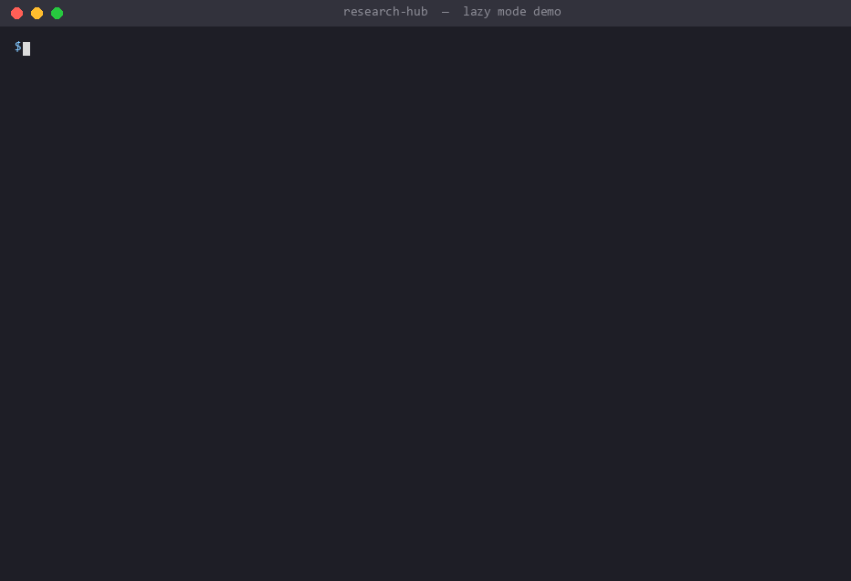
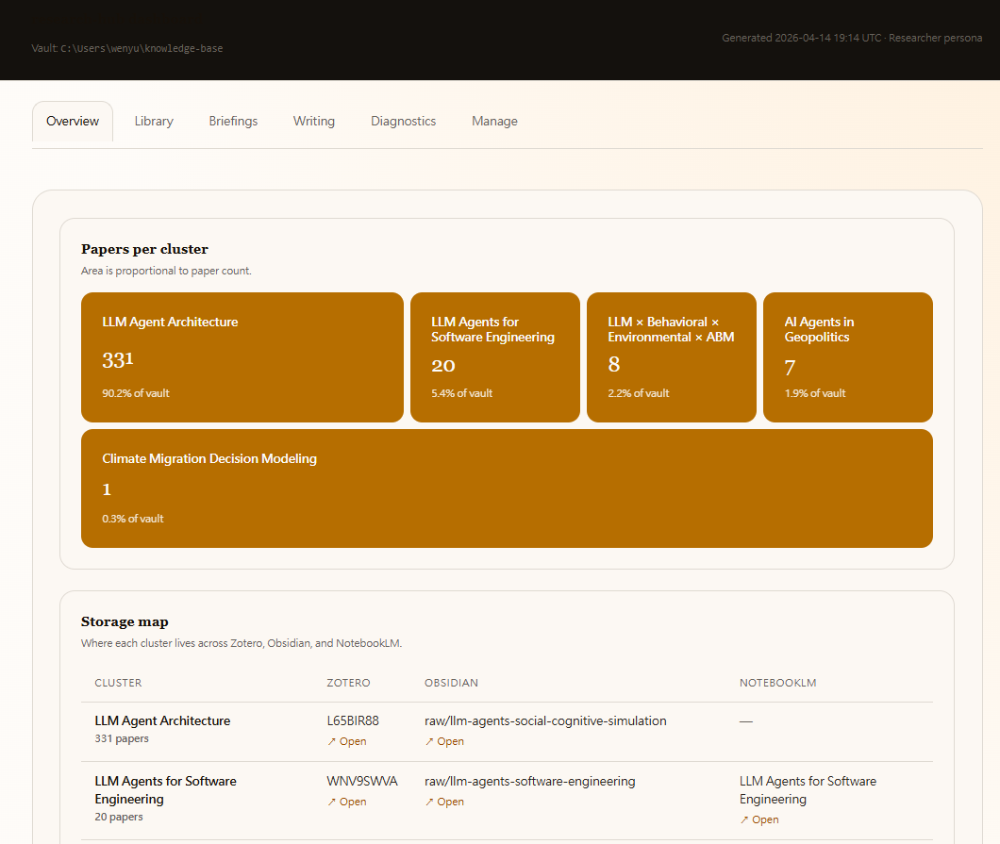
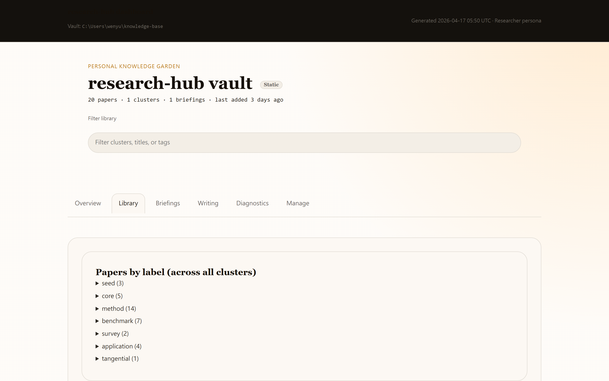
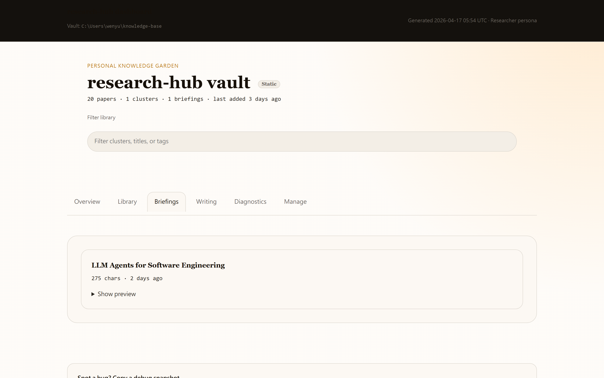
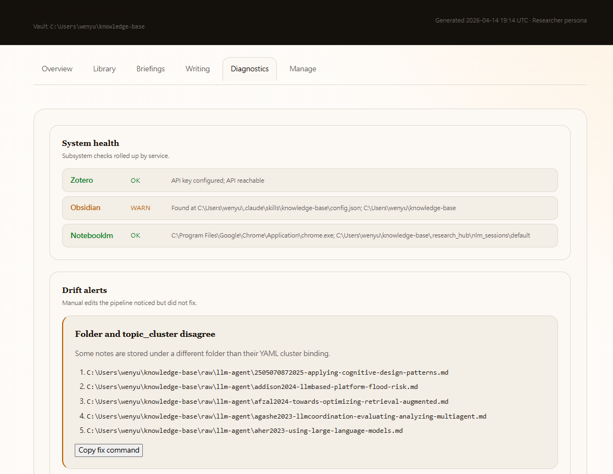
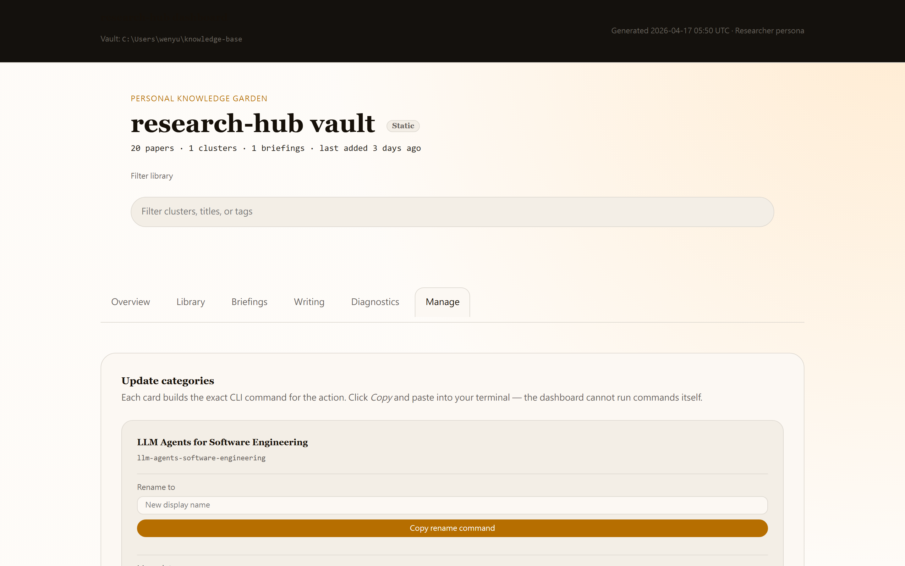
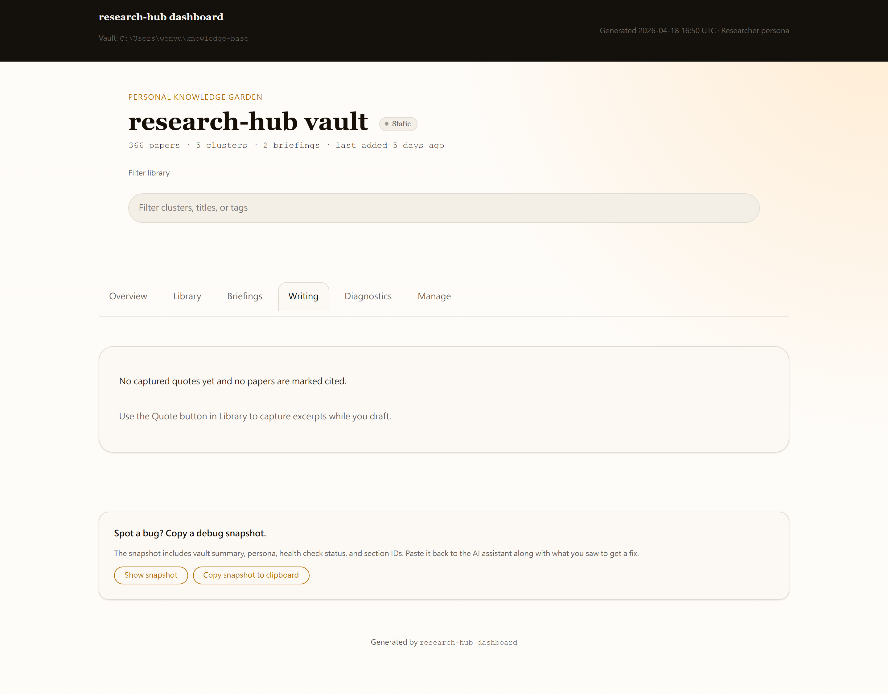

# research-hub

> **One sentence in. Cluster + papers + AI brief out. ~50 seconds.**
> Zotero + Obsidian + NotebookLM, wired together for AI agents — no API key required.

[](https://pypi.org/project/research-hub-pipeline/)
[](https://pypi.org/project/research-hub-pipeline/)
[](https://github.com/WenyuChiou/research-hub/stargazers)
[](docs/audit_v0.45.md)
[](docs/mcp-tools.md)
[](pyproject.toml)
[](LICENSE)
[](.github/workflows/ci.yml)
[](https://github.com/WenyuChiou/research-hub/commits/master)
[](https://github.com/WenyuChiou/research-hub/issues)

繁體中文 → [README.zh-TW.md](README.zh-TW.md)

---

## 📋 Prerequisites (check these first)

| Need | Why | How |
|---|---|---|
| **Python 3.10+** | All package code | `python --version` |
| **Obsidian** (free) | research-hub writes notes into a vault Obsidian renders | Download at [obsidian.md](https://obsidian.md) |
| **Google account with NotebookLM** | Powers the brief generation | Visit [notebooklm.google.com](https://notebooklm.google.com) once and accept terms |
| **Chrome** | patchright drives your local Chrome (no separate API key) | Install Chrome — `init` will probe it |
| **Zotero account + API key** *(researcher/humanities only)* | Sync papers + PDFs across devices | [zotero.org/settings/keys](https://www.zotero.org/settings/keys) |
| *(optional)* `claude` / `codex` / `gemini` CLI | Powers `auto --with-crystals` for fully automated runs | Install whichever AI CLI you already use |

`research-hub init` runs a **first-run readiness check** at the end that flags whichever of these is missing — no need to memorize the list.

---

## ⚡ Install + first run (60 seconds total)

```bash
pip install research-hub-pipeline[playwright,secrets]
research-hub init                                          # interactive: persona + Zotero/NLM + readiness check
research-hub notebooklm login                              # one-time Google sign-in
research-hub auto "harness engineering for LLM agents"     # done — 50s later you have 8 papers + a brief
```

**Want fully automated end-to-end** (search → ingest → NLM brief → cached AI answers)?

```bash
research-hub auto "harness engineering" --with-crystals    # auto-pipes through claude/codex/gemini CLI
```

**Not sure what to ask for? Plan first, then act** (v0.50):

```bash
research-hub plan "I want to learn about harness engineering"
# Prints: suggested topic, cluster, max_papers (auto-tuned for "thesis"/"learn" intents),
# warns about existing-cluster collisions, then prints the exact `auto` command to run.
```

When using Claude Desktop, just say "Claude, research X" and Claude will call `plan_research_workflow` first to confirm the plan with you before kicking off `auto_research_topic`.

If a supported LLM CLI is on your PATH, `--with-crystals` runs the crystal generation step automatically. If not, the prompt is saved to `.research_hub/artifacts/<slug>/crystal-prompt.md` and the Next Steps banner tells you exactly what to paste where.

---

## 🎬 30-second demo



The three commands above are **real captured terminal output** from the maintainer's Windows zh-TW vault:

1. **`plan`** — turn freeform intent into a confirmed workflow (~ms heuristics, no LLM).
2. **`ask`** — pre-computed crystal answer in <1 s (zero LLM tokens after the one-time crystal generation).
3. **`websearch`** — generic web search via DDG fallback; no API key required.

The first time you run `auto "topic" --with-crystals`, the full pipeline takes ~3 minutes and burns ~2,400 tokens (free with claude/codex/gemini CLI subscriptions). After that, every subsequent question against the cluster is a sub-second cached read at zero token cost.

How the GIF was made: see `docs/demo/build_demo_gif.py` — pure Python + PIL, no ffmpeg / asciinema. Re-run after vault updates to refresh.

**Two ways to drive it after install:**

| Path | What you do | What runs under the hood |
|---|---|---|
| **🤖 Talk to Claude** (recommended) | "Claude, research harness engineering for me" | Claude calls `auto_research_topic(...)` via MCP — one tool call |
| **💻 One-line CLI** | `research-hub auto "topic"` | Same orchestrator, called directly |
| **🖱 Click in dashboard** | `research-hub serve --dashboard` → Manage tab | Same actions, button-driven |

All three drive the **same** orchestrator. Pick whichever your hands are on.

---

## 🤖 Talk to Claude — 30-second setup

Add to `claude_desktop_config.json`:

```json
{
  "mcpServers": {
    "research-hub": {
      "command": "research-hub",
      "args": ["serve"]
    }
  }
}
```

Restart Claude Desktop. Then:

> **You:** "Claude, find me 5 papers on agent-based modeling and put them in a notebook."
> **Claude:** *calls `auto_research_topic(topic="agent-based modeling", max_papers=5)`* → 5 papers ingested + NotebookLM brief URL — ~50 s.

> **You:** "What's the SOTA in my llm-evaluation-harness cluster?"
> **Claude:** *calls `read_crystal("llm-evaluation-harness", "sota-and-open-problems")`* → 180-word pre-written answer with citations. **~1 KB read, 0 abstracts fetched at query time.**

**81 MCP tools** in total — full reference: [`docs/mcp-tools.md`](docs/mcp-tools.md). The big ones:

| Tool | What it replaces |
|---|---|
| `auto_research_topic(topic)` | 7-step CLI flow (search → ingest → bundle → upload → generate → download) |
| `cleanup_garbage(everything=True)` | `du -sh .research_hub/bundles/*` + manual `rm -rf` |
| `tidy_vault()` | `doctor --autofix` + `dedup rebuild` + `bases emit --force` + cleanup preview |
| `ask_cluster_notebooklm(cluster, question)` | Open NotebookLM tab, paste question, copy answer |
| `read_crystal(cluster, slot)` | Re-read 20 paper abstracts to answer the same question again |
| `list_claims(cluster, min_confidence)` | Skim hub overview hoping a claim is in the right paragraph |
| `add_paper(arxiv_id, cluster)` | Manual Zotero add → manual Obsidian note → manual NotebookLM upload |

---

## 📊 At a glance — every feature in one table

| Capability | Command (or MCP tool) | Notes |
|---|---|---|
| **Lazy mode** — one sentence in, brief out | `auto "topic"` / `auto_research_topic` | search → ingest → NLM brief in ~50s |
| **Lazy maintenance** | `tidy` / `tidy_vault` | doctor + dedup + bases + cleanup preview |
| **GC accumulated junk** | `cleanup --all --apply` / `cleanup_garbage` | bundles + debug logs + stale artifacts |
| **Ad-hoc NLM Q&A** | `ask --cluster X "Q?"` / `ask_cluster_notebooklm` | dual backend (NLM + crystal cache) |
| **Pre-computed crystals** | `crystal emit / apply` | 10 canonical Q→A per cluster, ~1 KB/answer |
| **Structured memory** | `memory emit / apply` + `list_entities/claims/methods` | typed entities, claims with confidence, method taxonomies |
| **Live dashboard** | `serve --dashboard` | 6 tabs, persona-aware, Manage tab buttons execute CLI directly |
| **4 personas, 1 codebase** | `RESEARCH_HUB_PERSONA=researcher\|humanities\|analyst\|internal` | vocabulary + hidden tabs adapt |
| **100% orphan coverage** | `clusters rebind --emit` then `--apply` | 8-heuristic chain, auto-create-from-folder proposals |
| **Health checks (12+)** | `doctor` / `doctor --autofix` | mechanical backfills, patchright Chrome probe |
| **Multi-backend search** | `search "query"` | arXiv + Semantic Scholar (default) + Crossref DOI lookup |
| **Cluster autosplit** | `clusters analyze --split-suggestion` | networkx greedy modularity on citation graph |
| **Obsidian Bases dashboard** | `bases emit` / `emit_cluster_base` | auto-generated `.base` per cluster (auto-refreshes on ingest) |
| **NotebookLM upload** | `notebooklm upload --cluster X` | patchright + persistent Chrome (no API key, no quota) |
| **Citation graph** | `vault graph-colors` | networkx + Obsidian graph view colors |
| **Local file ingest** | `import-folder /path` | PDF / DOCX / MD / TXT / URL (analyst persona) |
| **Generic web search** (v0.51) | `websearch "query"` / `web_search` | Tavily / Brave / Google CSE / DDG fallback (no key needed) |
| **Field auto-detection** (v0.51) | `plan "intent"` → suggested `--field` | bio/med queries pick pubmed; cs queries pick arxiv+s2; etc. |

[→ Full lazy-mode guide](docs/lazy-mode.md) · [→ All commands](docs/dashboard-walkthrough.md) · [→ MCP reference](docs/mcp-tools.md)

---

## 🖥 What the dashboard looks like

`research-hub serve --dashboard` opens `http://127.0.0.1:8765/` — six tabs, all driven by the same data your CLI sees.

| | |
|---|---|
|  |  |
| **Overview** — treemap + storage map + recent feed + crystals coverage | **Library** — clusters drilled into sub-topics + per-paper rows |
|  |  |
| **Briefings** — NotebookLM brief preview + artifact links | **Diagnostics** — health badges + drift alerts (grouped by kind in v0.48) |
|  |  |
| **Manage** — every CLI action as a button (rename / merge / split / NLM upload / ask / polish-markdown / bases emit) | **Writing** — quote capture + draft composer + BibTeX export |

[→ Dashboard walkthrough](docs/dashboard-walkthrough.md) · [→ All 4 persona variants](docs/personas.md)

---

## 🧠 What makes it different

### 1. Pre-computed answers, not lazy retrieval

Every RAG system still assembles context at query time. research-hub's answer: **store the AI's reasoning, not the inputs**.

For each cluster you generate ~10 canonical Q→A **crystals** once with any LLM. Later queries read a pre-written paragraph (~1 KB), not 20 paper abstracts (~30 KB) — **30× compression** with quality that doesn't degrade at query time. Underneath, a structured **memory layer** holds the entities, typed claims with confidence, and method taxonomies that crystals reference. AI agents query via `list_entities`, `list_claims(min_confidence="high")`, `list_methods` — no RAG over prose, structured lookup over structured data.

Example cluster from the maintainer's vault: `hub/llm-evaluation-harness/` has 10 crystals + 14 entities + 12 claims + 7 methods, all generated once. After `research-hub auto "harness engineering" --with-crystals` your own vault will look the same. [→ Why this is not RAG](docs/anti-rag.md)

### 2. Three control surfaces, one orchestrator

CLI, dashboard buttons, and MCP tools all call the same Python orchestrator. There is no "REST mode" or "API mode" with diverging behavior. Whatever you can do at the shell, Claude can do via MCP, and vice versa.

### 3. Provider-agnostic by design

**No OpenAI / Anthropic API key required.** All AI generation uses an `emit` / `apply` pattern: `emit` writes a self-contained prompt to stdout, you paste into your AI of choice (Claude, GPT, Gemini, local model), `apply` ingests the JSON response. NotebookLM browser automation uses your own logged-in Chrome — no quota, no per-token billing.

---

## ⚖️ How it compares to the alternatives

Honest, side-by-side. research-hub doesn't replace any of these — it stitches them together so an AI agent can drive them all.

| What you can do | Zotero alone | NotebookLM alone | Generic RAG (LangChain etc.) | Obsidian-Zotero plugin | **research-hub** |
|---|---|---|---|---|---|
| Search arXiv + Semantic Scholar in one command | ❌ | ❌ | DIY | ❌ | ✅ `auto "topic"` |
| One-shot ingest into Zotero **and** Obsidian **and** NotebookLM | ❌ | ❌ | DIY | partial (Z↔O only) | ✅ `auto` |
| AI brief from your collection | ❌ | ✅ (manual) | DIY | ❌ | ✅ auto-generated |
| Cached canonical Q→A so the AI doesn't re-RAG every query | ❌ | ❌ | ❌ (RAG re-fetches) | ❌ | ✅ crystals (~1 KB/answer) |
| Structured memory layer (entities + typed claims + methods) | ❌ | ❌ | unstructured chunks | ❌ | ✅ `list_entities/claims/methods` |
| Direct AI-agent control via MCP | ❌ | ❌ | DIY MCP server | ❌ | ✅ 81 MCP tools |
| Live HTML dashboard with action buttons | ❌ | ❌ | ❌ | ❌ | ✅ `serve --dashboard` |
| Auto-cluster papers + detect drift + auto-rebind orphans | ❌ | ❌ | ❌ | ❌ | ✅ `clusters rebind` |
| Per-cluster Obsidian Bases dashboard | ❌ | ❌ | ❌ | ❌ | ✅ `bases emit` |
| **No API key required for AI** | n/a | ✅ | ❌ | n/a | ✅ |
| **Local-first vault you own** | ✅ (cloud-sync) | ❌ (Google) | depends | ✅ | ✅ |
| Cost per 1000 queries | n/a | quota-limited | ~$5–50 (token billing) | n/a | **$0** (cached crystals) |

The honest takeaway: research-hub is **only worth it if you already use 2-of-3** Zotero / Obsidian / NotebookLM and want to AI-agentize the workflow. If you only use one, the simpler tools alone are fine.

---

## 📦 Install variants

```bash
# Researcher / Humanities (Zotero + NotebookLM)
pip install research-hub-pipeline[playwright,secrets]

# Analyst / Internal KM (no Zotero, import local files)
pip install research-hub-pipeline[import,secrets]

# Everything for development
pip install -e '.[dev,playwright,import,secrets,mcp]'
```

Python 3.10+. Optional `npm install -g defuddle-cli` for cleaner URL imports.

---

## 📚 Docs

| | |
|---|---|
| [First 10 minutes](docs/first-10-minutes.md) | Guided tour for each persona |
| [Lazy-mode reference](docs/lazy-mode.md) | The 4 one-sentence commands |
| [Dashboard walkthrough](docs/dashboard-walkthrough.md) | Tab-by-tab tour with persona recipes |
| [MCP tools reference](docs/mcp-tools.md) | All 81 tools, categorized + signatures |
| [Personas](docs/personas.md) | 4 persona profiles + per-persona feature matrix |
| [Cluster integrity](docs/cluster-integrity.md) | 6 failure modes × 4 personas mitigation matrix |
| [Anti-RAG / crystals](docs/anti-rag.md) | Why pre-computed Q→A beats retrieval |
| [NotebookLM setup](docs/notebooklm.md) + [troubleshooting](docs/notebooklm-troubleshooting.md) | patchright + persistent Chrome (v0.42+) |
| [Import folder](docs/import-folder.md) | Local PDF/DOCX/MD/TXT/URL ingest |
| [Papers input schema](docs/papers_input_schema.md) | Ingestion pipeline reference |
| [Upgrade guide](UPGRADE.md) | Migrating from older versions |
| [Audit reports](docs/) | `audit_v0.26.md` … `audit_v0.45.md` |
| [CHANGELOG](CHANGELOG.md) | Per-version release notes |

---

## 🩺 Troubleshooting (first-run problems)

| Symptom | Cause | Fix |
|---|---|---|
| `research-hub init` says `chrome WARN patchright cannot launch Chrome` | Chrome not installed, or patchright cannot find it | Install Chrome from chrome.com; rerun `research-hub doctor` to re-probe |
| `research-hub notebooklm login` opens browser but Google blocks login | Headless / new device challenge | The browser is patchright (real Chrome) — click "Yes, it's me" on your phone, then complete login normally |
| `research-hub auto` fails at `search` step with `0 papers` | Topic too narrow, or arXiv/SemSch transient outage | Re-run with `--max-papers 20` or rephrase the topic; both backends are fault-tolerant |
| `research-hub auto` fails at `nlm.upload` with "Generation button not found" | NotebookLM UI changed, or you're not logged in | Run `research-hub notebooklm login` again; if persists, file an issue with the `nlm-debug-*.jsonl` from `.research_hub/` |
| `auto --with-crystals` falls back to "no LLM CLI on PATH" | Neither `claude`, `codex`, nor `gemini` CLI installed | Install whichever AI CLI you use; or generate crystals manually with `crystal emit` → paste → `crystal apply` |
| Claude Desktop doesn't see the MCP server | `claude_desktop_config.json` not in expected location | macOS: `~/Library/Application Support/Claude/claude_desktop_config.json` · Windows: `%APPDATA%\Claude\claude_desktop_config.json` · restart Claude Desktop after editing |
| `init` reports `zotero WARN` but I don't use Zotero | Default persona is `researcher` which expects Zotero | Re-run `research-hub init --persona analyst` (or `internal`) — these personas skip Zotero entirely |

For everything else: `research-hub doctor --autofix` repairs the common mechanical issues; the report tells you which subsystem to look at.

---

## 🛠 Status

- **Latest**: v0.52.0 (2026-04-20) — REST JSON API at `/api/v1/*` with bearer-token auth + CORS so any HTTP client (Claude.ai web, ChatGPT, OpenAI Custom GPT, browser-based AIs) can call research-hub directly. See [`CHANGELOG.md`](CHANGELOG.md).
- **Tests**: 1583 passing on the fast suite (CI: Linux + Windows + macOS × Python 3.10/3.11/3.12 = 9 jobs)
- **MCP tools**: 83 (v0.47 auto/cleanup/tidy; v0.49 extended `auto_research_topic`; v0.50 added `plan_research_workflow`; v0.51 added `web_search`)
- **REST endpoints**: 12 at `/api/v1/*` covering health / clusters / crystals / search / websearch / plan / ask / auto (async via job queue)
- **End-to-end verified**: as of v0.49.5, the full lazy-mode flow — `auto "topic" --with-crystals` → search → ingest → NotebookLM brief → cached AI answers — is verified working on a Windows zh-TW machine with the real `claude` CLI. See [`CHANGELOG.md`](CHANGELOG.md) v0.49.4 for the full per-stage results table.
- **Dependencies**: `pyzotero`, `pyyaml`, `requests`, `rapidfuzz`, `networkx`, `platformdirs` (all pure-Python)
- **Optional**: `[playwright]` for NotebookLM, `[import]` for local file ingest, `[secrets]` for OS-keyring credential storage

## 👩‍💻 For developers

```bash
git clone https://github.com/WenyuChiou/research-hub.git
cd research-hub
pip install -e '.[dev,playwright]'
python -m pytest -q                     # 1583 passing
```

Contributing: [CONTRIBUTING.md](CONTRIBUTING.md). Security: [SECURITY.md](.github/SECURITY.md).

Package on PyPI: **research-hub-pipeline** · CLI entry point: **research-hub**

## License

MIT. See [LICENSE](LICENSE).
