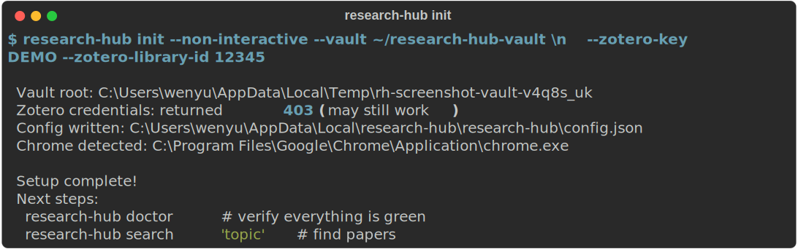
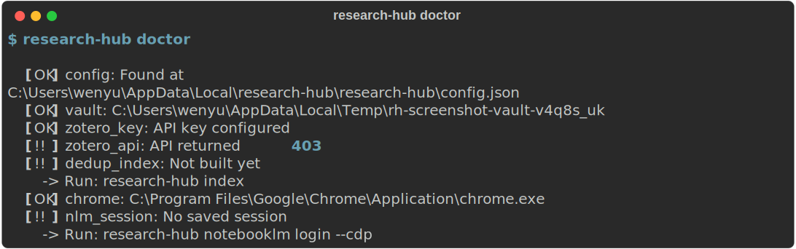
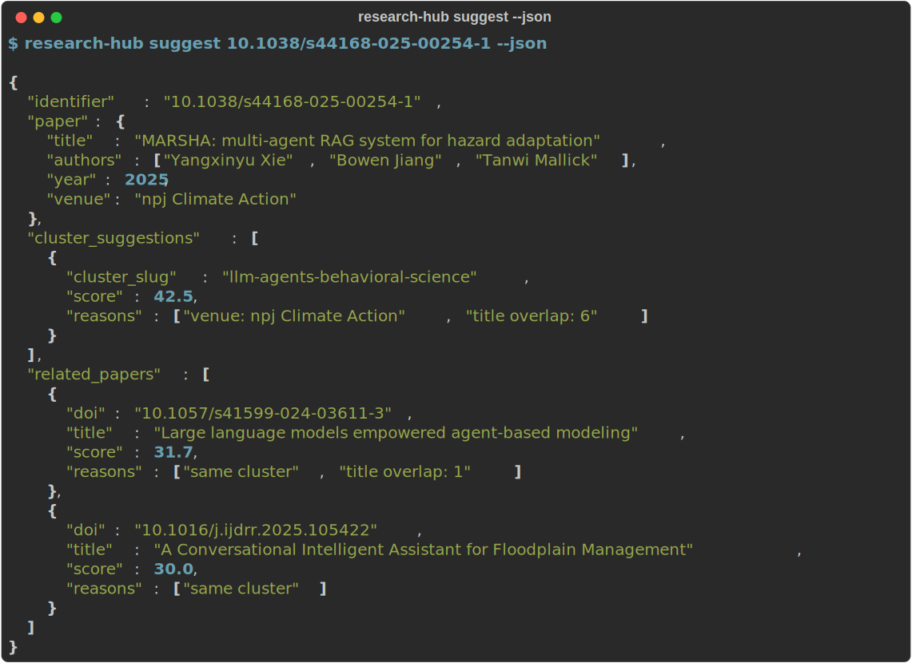

# research-hub-pipeline

Zotero -> Obsidian -> NotebookLM research pipeline.
Search, verify, save, organize, and upload academic papers -> all from the terminal.

## Install

```bash
pip install research-hub-pipeline
# With NotebookLM browser automation:
pip install research-hub-pipeline[playwright]
playwright install chromium
```

`research-hub` requires Python 3.10 or newer. Install the `playwright`
extra only if you plan to use NotebookLM login, upload, or generation.

## Screenshots

### First-time setup



### Health check



### Proactive integration suggestions



### Install AI assistant skill


## Quick start

1. Run the first-time setup wizard:

   ```bash
   research-hub init
   ```

   This creates your config file, vault folders, and optional Zotero
   settings.

2. Verify the installation:

   ```bash
   research-hub doctor
   ```

   The health check reports config, vault paths, Zotero credentials,
   dedup index status, Chrome availability, and NotebookLM session state.

3. Search for papers and verify DOIs while printing results:

   ```bash
   research-hub search "graph neural networks" --verify
   ```

4. Ask for cluster and related-paper suggestions for a DOI:

   ```bash
   research-hub suggest 10.1145/3448016.3452841 --json
   ```

5. Ingest papers into your Zotero + Obsidian workflow:

   ```bash
   research-hub ingest --cluster my-cluster
   ```

6. Upload a prepared cluster to NotebookLM:

   ```bash
   research-hub notebooklm upload --cluster my-cluster
   ```

7. Export a citation when you need it:

   ```bash
   research-hub cite 10.1145/3448016.3452841 --format bibtex
   ```

If you are starting from scratch, a common first session is:

```bash
research-hub init
research-hub doctor
research-hub clusters new --query "graph neural networks" --slug my-cluster
research-hub search "graph neural networks" --verify
research-hub ingest --cluster my-cluster
research-hub notebooklm login --cdp
research-hub notebooklm upload --cluster my-cluster
```

## Features

The CLI is organized around a paper workflow: find papers, verify
identifiers, save notes, keep clusters aligned, and push selected
clusters into NotebookLM.

| Stage | Command | Description |
|---|---|---|
| **Search** | `search` | Query Semantic Scholar for new papers by keyword |
| **Verify** | `verify --doi` / `verify --arxiv` / `verify --paper` | Check that a DOI, arXiv ID, or fuzzy title match resolves |
| **Save** | `run` / `ingest` | Run the ingestion pipeline and write Zotero + Obsidian outputs |
| **Organize** | `clusters new` / `clusters list` / `clusters show` / `clusters bind` | Create, inspect, and bind topic clusters |
| **Suggest** | `suggest <id> [--json]` | Recommend a cluster and related existing papers |
| **Sync** | `sync status` / `sync reconcile` | Detect and reconcile Zotero -> Obsidian drift |
| **Upload** | `notebooklm upload` | Upload bundle sources to NotebookLM using a saved browser session |
| **Generate** | `notebooklm generate --type brief` | Trigger NotebookLM artifact generation |
| **Cite** | `cite <id> --format bibtex` | Export BibTeX, BibLaTeX, RIS, or CSL-JSON |
| **Maintain** | `index` / `status` / `cleanup` / `synthesize` | Rebuild indexes, check progress, deduplicate hub pages, generate synthesis pages |
| **Setup** | `init` / `doctor` | Create config and validate the local environment |

### Search and verify

Use `search` to discover candidate papers before adding anything to your
vault:

```bash
research-hub search "retrieval augmented generation" --limit 10
```

Add `--verify` when you want each DOI checked against `doi.org` before
it is printed:

```bash
research-hub search "retrieval augmented generation" --limit 10 --verify
```

Use `verify` directly when you already know the identifier:

```bash
research-hub verify --doi 10.48550/arXiv.1706.03762
research-hub verify --arxiv 1706.03762
research-hub verify --paper "Attention Is All You Need" --paper-year 2017
research-hub verify --paper "Attention Is All You Need" --paper-author Vaswani
```

### Run ingestion

`run` and `ingest` both execute the pipeline. Use `--dry-run` when you
want to validate config and inputs without writing anything:

```bash
research-hub ingest --cluster my-cluster --dry-run
research-hub ingest --cluster my-cluster --query "retrieval augmented generation"
research-hub run --cluster my-cluster --query "retrieval augmented generation"
```

Verification is enabled by default for `run` and `ingest`. Skip DOI or
arXiv checks only when you want faster batch work:

```bash
research-hub ingest --cluster my-cluster --no-verify
```

### Organize by cluster

Clusters give the rest of the workflow a stable slug for folders,
Zotero collections, and NotebookLM notebooks:

```bash
research-hub clusters new --query "retrieval augmented generation" --name "RAG" --slug rag
research-hub clusters list
research-hub clusters show rag
research-hub clusters bind rag --zotero ABCD1234 --obsidian rag --notebooklm "RAG Notebook"
```

### Get suggestions before saving

`suggest` accepts a DOI, arXiv ID, or quoted title and scores both
cluster matches and related existing notes:

```bash
research-hub suggest 10.48550/arXiv.1706.03762
research-hub suggest 1706.03762 --top 8
research-hub suggest "Attention Is All You Need" --json
```

This is the fastest way to decide whether a new paper belongs in an
existing cluster before you ingest it.

### Track status and repair drift

Use `status` for reading progress, `sync status` for cross-system drift,
and `sync reconcile` to create missing Obsidian notes from Zotero:

```bash
research-hub status
research-hub status --cluster rag
research-hub sync status
research-hub sync status --cluster rag
research-hub sync reconcile --cluster rag --dry-run
research-hub sync reconcile --cluster rag --execute
```

### Export citations

`cite` can export one paper by DOI or filename stem, or an entire
cluster:

```bash
research-hub cite 10.48550/arXiv.1706.03762 --format bibtex
research-hub cite 10.48550/arXiv.1706.03762 --format ris
research-hub cite --cluster rag --format biblatex --out rag.bib
```

Supported output formats are `bibtex`, `biblatex`, `ris`, and
`csljson`.

### Maintain the vault

These commands help keep the local knowledge base consistent:

```bash
research-hub index
research-hub cleanup --dry-run
research-hub cleanup
research-hub synthesize
research-hub synthesize --cluster rag --graph-colors
research-hub migrate-yaml --dry-run
research-hub migrate-yaml --assign-cluster rag --folder raw --force
```

`index` rebuilds the dedup index from Zotero and Obsidian. `cleanup`
removes duplicate wiki links in hub pages. `synthesize` writes cluster
summary pages. `migrate-yaml` patches older notes to the current YAML
layout.

### NotebookLM workflow

NotebookLM commands are separate because they require browser
automation:

```bash
research-hub notebooklm login --cdp
research-hub notebooklm bundle --cluster rag
research-hub notebooklm upload --cluster rag --dry-run
research-hub notebooklm upload --cluster rag
research-hub notebooklm generate --cluster rag --type brief
research-hub notebooklm generate --cluster rag --type all
```

Use `--headless` for unattended runs or `--visible` when you want to
watch the browser. `generate --type` supports `brief`, `audio`,
`mind-map`, `video`, and `all`.

## Configuration

`research-hub init` writes a JSON config file automatically. By default
the config file lives at `~/.config/research-hub/config.json` on Linux
and macOS, or `%APPDATA%/research-hub/config.json` on Windows.

If you want to point the CLI at a different file, set
`RESEARCH_HUB_CONFIG`.

The vault root comes from config field `knowledge_base.root` or from
`RESEARCH_HUB_ROOT`. If neither is set, the default root is
`~/knowledge-base`.

Useful path overrides:

- `RESEARCH_HUB_RAW`
- `RESEARCH_HUB_HUB`
- `RESEARCH_HUB_PROJECTS`
- `RESEARCH_HUB_LOGS`
- `RESEARCH_HUB_GRAPH`

Zotero credentials can come from config or environment variables:

- `ZOTERO_API_KEY`
- `ZOTERO_LIBRARY_ID`
- `ZOTERO_LIBRARY_TYPE`
- `RESEARCH_HUB_DEFAULT_COLLECTION`

The typical vault layout created by `research-hub init` is:

```text
<vault>/
  raw/
  hub/
  logs/
  .research_hub/
```

After setup, `research-hub doctor` is the fastest way to confirm the
config file, vault, Zotero credentials, dedup index, Chrome, and saved
NotebookLM session all look valid.

## NotebookLM integration

NotebookLM support uses a Chrome DevTools Protocol attach flow rather
than a Playwright-launched browser, which avoids the Google bot check
that blocks normal automated logins. Install Chrome, run
`research-hub notebooklm login --cdp` once, then use
`notebooklm bundle`, `notebooklm upload`, and `notebooklm generate` for
cluster-level workflows. Full setup, troubleshooting, and selector
maintenance notes are in [docs/notebooklm.md](docs/notebooklm.md).

## For developers

If you are working from a clone instead of installing from PyPI:

```bash
git clone https://github.com/WenyuChiou/research-hub.git
cd research-hub
pip install -e '.[dev,playwright]'
python -m pytest -q
```

Useful developer checks:

```bash
research-hub --help
research-hub doctor
research-hub search "test query" --limit 3
```

The package entry point is `research-hub`, while the PyPI package name
is `research-hub-pipeline`.

## License

MIT. See [LICENSE](LICENSE).
