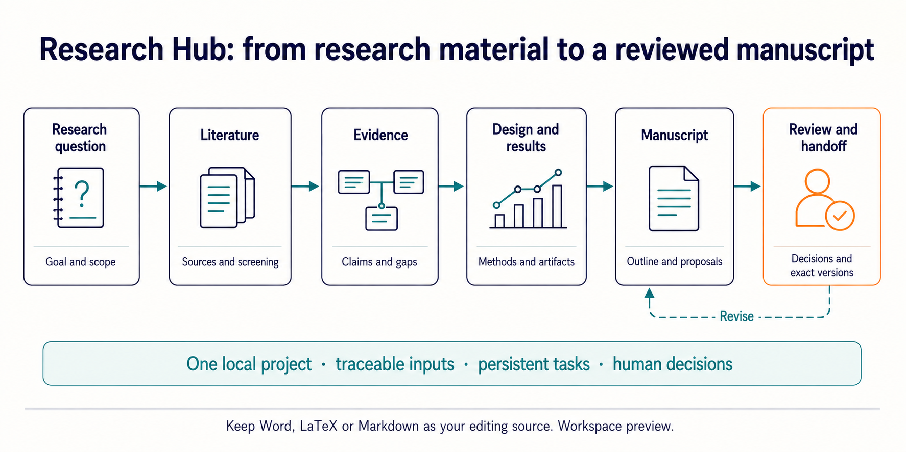
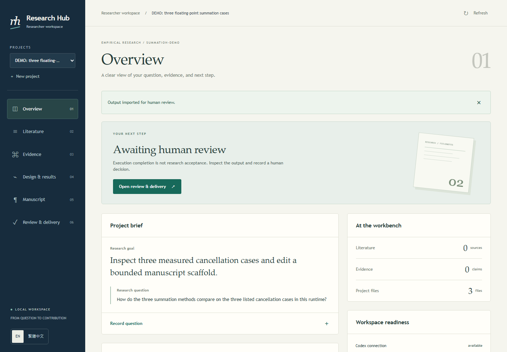
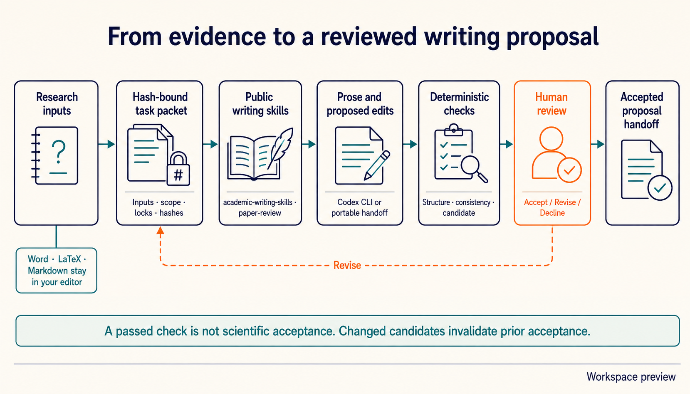

<!-- mcp-name: io.github.WenyuChiou/research-hub -->

# research-hub

A local workspace connecting literature, research artifacts, and manuscripts through traceable work.

[繁體中文](README.zh-TW.md) · [Workspace guide](docs/workspace-guide.md) · [Existing setup](docs/setup.md) · [Developer architecture](docs/workspace-architecture.md)

[](https://pypi.org/project/research-hub-pipeline/)
[](pyproject.toml)
[](LICENSE)

> **Workspace preview — unreleased.** The six-page workspace below is on `codex/researcher-workspace`. PyPI `1.2.0` does not include it. Use the branch installation below, or try the published literature dashboard.

## Why this exists

Research crosses files and tools: a paper informs a question, an analysis changes a result, and a manuscript needs revision. Keep those connections visible when you or an AI assistant picks up the next task.



Start with local files. Connect Zotero for references, Obsidian for notes, and NotebookLM for source-based briefings when needed. Empirical studies and literature reviews share the workspace.

## What you work with



| Page | Your work |
|---|---|
| Project | State the question, goal, and project type. |
| Literature | Find references and record inclusion or exclusion decisions. |
| Evidence | Connect claims to sources and inspect unresolved support. |
| Design & results | Record methods, results, limitations, and supporting files. |
| Manuscript | Register Word, LaTeX, or Markdown; prepare outlines and revisions. |
| Review & delivery | Inspect proposals, record decisions, and prepare a local handoff. |

Files stay in your selected workspace. Registration records paths and hashes; your editor remains responsible for changing original documents.

## How to try it

### Workspace preview

Use Python 3.10+ and Git. Choose a **new or empty** `workspace-demo` directory.

```sh
git clone -b codex/researcher-workspace https://github.com/WenyuChiou/research-hub.git
cd research-hub
python -m pip install -e '.[mcp]'
research-hub project demo --root ./workspace-demo --json
research-hub serve --workspace --root ./workspace-demo
```

Open [the local workspace](http://127.0.0.1:8765/app/). The demo needs no account and contains a small numerical summation example and a literature-review fixture. These are teaching inputs, not model-generated research findings.

Follow the [workspace guide](docs/workspace-guide.md) for your own files, writing setup, task handoffs, and review. See [dated verification and remaining checks](docs/workspace-guide.md#verification) before relying on the preview.

### Published literature dashboard

```sh
python -m pip install research-hub-pipeline
research-hub dashboard --sample
```

This account-free sample opens the existing dashboard. For real integrations, use the [setup guide](docs/setup.md), [first 10 minutes](docs/first-10-minutes.md), and [dashboard tour](docs/dashboard-walkthrough.md).

## How writing works



| Mode | What happens |
|---|---|
| Portable handoff | Export a task for your AI host; import its prose and candidate hashes. Export leaves the task waiting for the agent. |
| Connected Codex | An authenticated, compatible Codex CLI uses an explicitly trusted public writing bundle to produce prose without tools. Results wait for human review. |

The [public writing adapter preview](https://github.com/WenyuChiou/academic-writing-skills/pull/17) is a separate, unmerged contribution. [Verify and configure it explicitly](docs/workspace-guide.md#writing-adapter-preview); it is not a released dependency. Connected Codex receives bounded text excerpts, not binary document contents. Use your editor for Word formatting, LaTeX compilation, and final document changes.

## What you can trust

- **Traceable inputs:** tasks retain input revisions, results, and decisions. Changed registered bytes can make a task stale; the workspace reports review impact.
- **Separate judgments:** a resolvable reference does not prove a claim. Source identity, claim support, and human task acceptance remain distinct.
- **Explicit handoff:** accepted proposals can enter a separately approved local ZIP. This does not authorize publication or cloud upload.

Local approval records an operator's assertion; it does not authenticate identity on a shared computer. Existing direct-write MCP, dashboard, and cloud tools are outside workspace approval protection. The workflow's eight stages do not advance automatically when a task finishes. Read the [boundaries and recovery guide](docs/workspace-guide.md#boundaries-and-recovery).

<details>
<summary>Existing integrations, credentials, and troubleshooting</summary>

<a id="start-here"></a>
<a id="first-run-checklist"></a>

Use [setup](docs/setup.md) to choose integrations, then run `research-hub doctor`. NotebookLM needs a visible Google sign-in; its last recorded authentication attempt failed and has not been reverified. Treat that integration as degraded/unchecked until your own check succeeds. See [NotebookLM setup](docs/notebooklm.md) and [troubleshooting](docs/notebooklm-troubleshooting.md).

| Existing persona | Optional extras |
|---|---|
| Researcher | `[playwright,secrets]` |
| Humanities | `[playwright,secrets]` |
| Analyst | `[import,secrets]` |
| Internal KM | `[import,secrets]` |

<a id="credential-reference"></a>

These credentials apply to the existing integrations; the local workspace demo needs none.

<!-- env-vars-table-start -->

| Name | Required | Purpose |
|---|---|---|
| `ZOTERO_API_KEY` | Zotero only | Zotero API authentication |
| `ZOTERO_LIBRARY_ID` | Zotero only | Zotero library identifier |
| `SEMANTIC_SCHOLAR_API_KEY` | no | Optional search API key |
| `SEMANTIC_SCHOLAR_RPS` | no | Optional search request-rate override |
| `TAVILY_API_KEY` | no | Optional web search backend |
| `BRAVE_API_KEY` | no | Optional web search backend |

<!-- env-vars-table-end -->

<a id="connect-your-ai-host"></a>

Connect through [MCP/REST](docs/ai-integrations.md), check the [AI host support matrix](docs/ai-host-support.md), or use [local file import](docs/import-folder.md). The [CLI reference](docs/cli-reference.md), [EZproxy guide](docs/ezproxy.md), and [live smoke checklist](docs/live-smoke.md) cover detailed operations.

</details>

## Developer links

The [workspace architecture](docs/workspace-architecture.md) explains the task ledger and approval boundaries. See the [workflow runtime](docs/workflow-runtime.md), [MCP tools](docs/mcp-tools.md), [stable API](docs/stable-api.md), [file formats](docs/file-formats.md), and [OpenWiki](openwiki/quickstart.md) for technical detail. Use `python -m research_hub describe --filter mcp_tools` and `--filter skills` for current inventories.

Earlier dashboard material remains available: [MCP flow diagram](docs/images/research-hub-cover.png), [recorded dashboard demo](docs/images/dashboard-walkthrough.gif), and [full-resolution video](docs/demo/dashboard-walkthrough.mp4).

[Contributing](CONTRIBUTING.md) · [Releases](CHANGELOG.md) · [Release process](docs/RELEASING.md) · [MIT license](LICENSE)
