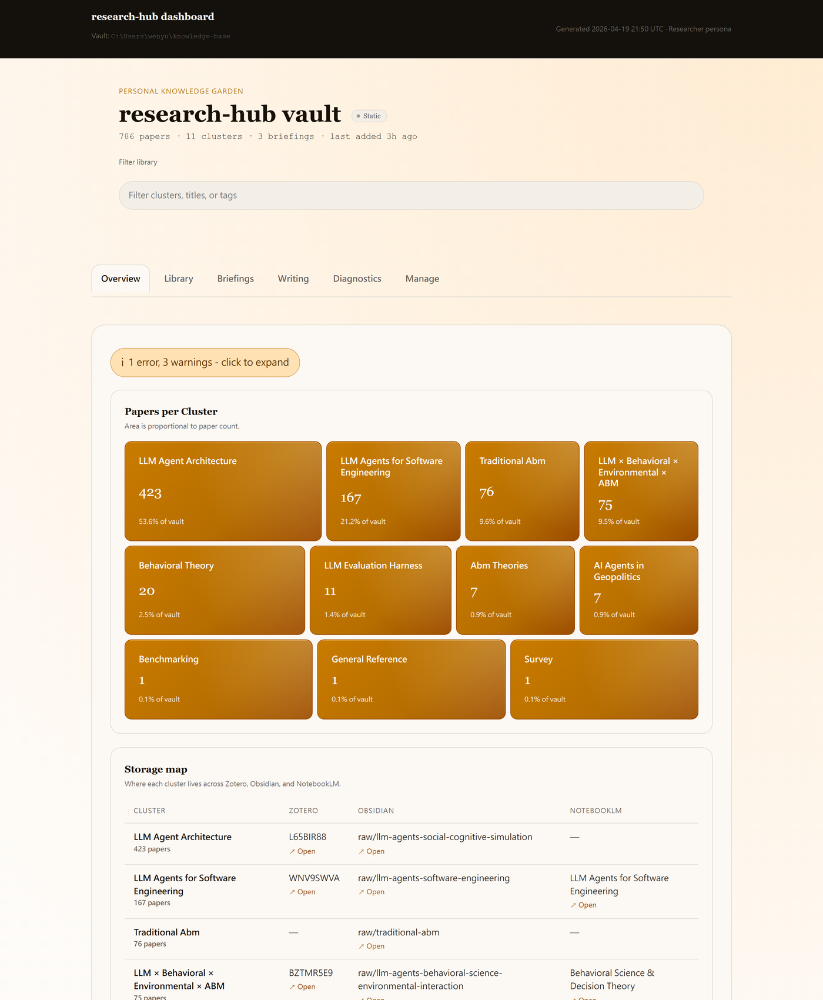
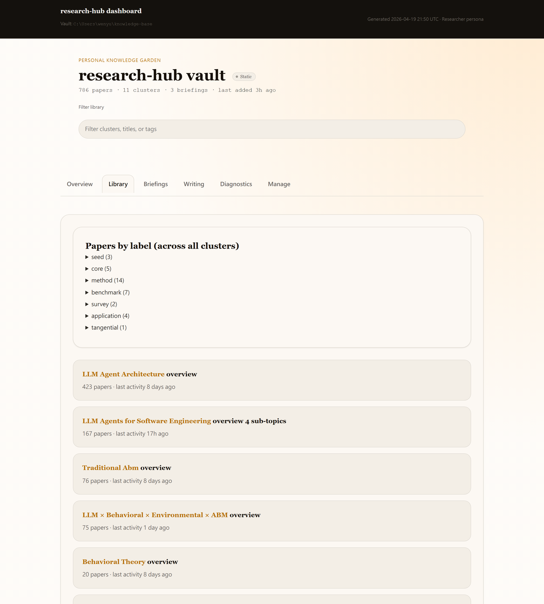
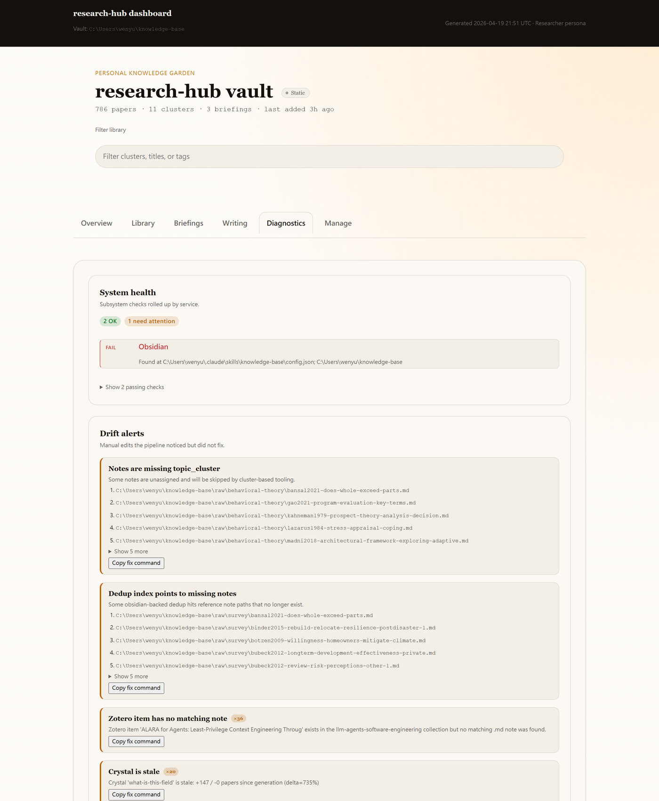
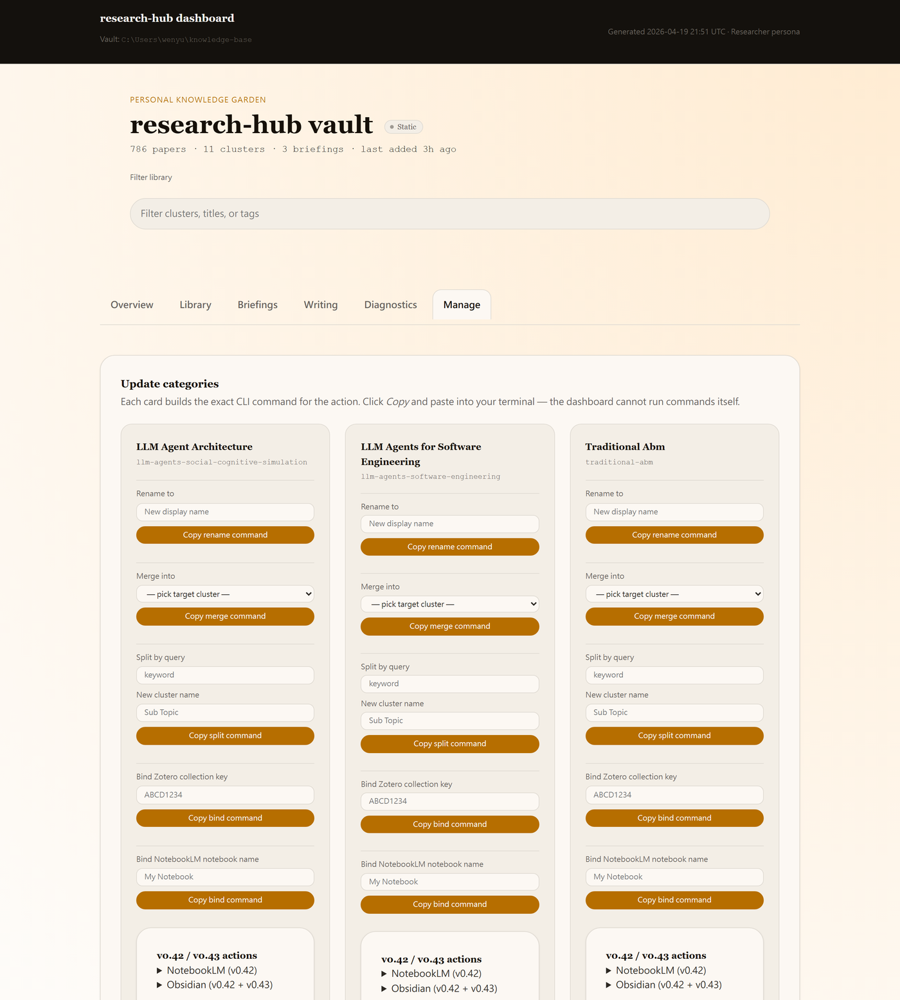
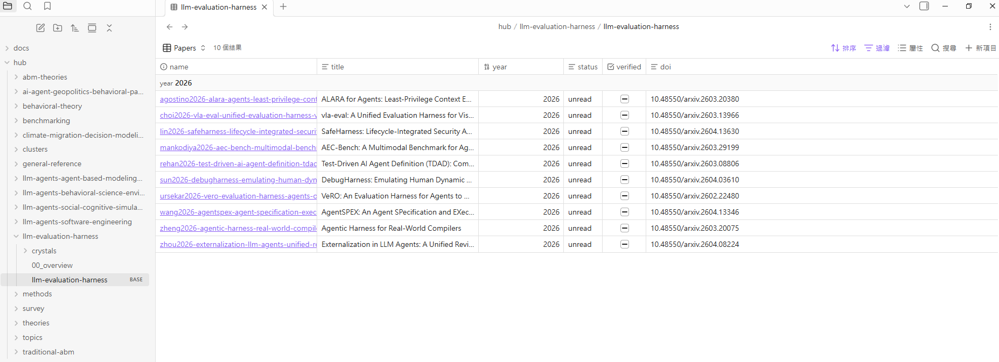
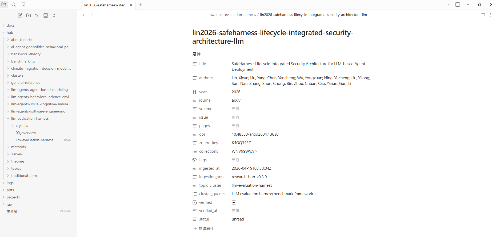

# research-hub

> **一句話輸入，輸出研究主題、論文與 AI 摘要，約 50 秒。**
> 把 Zotero、Obsidian、NotebookLM 串成 AI agent 可操作的研究流程，不需要 OpenAI 或 Anthropic API key。


[](https://pypi.org/project/research-hub-pipeline/)
[](docs/audit_v0.45.md)
[](pyproject.toml)
[](LICENSE)

English: [README.md](README.md) | [觀看完整解析度 mp4](docs/demo/dashboard-walkthrough.mp4)

---

## 支援任何 AI host

只要你的 AI 能載入 MCP tool、執行 shell command，或呼叫 HTTP API，就能操作 research-hub。

| AI host | research-hub 連接方式 |
|---|---|
| Claude Desktop | 透過 `claude_desktop_config.json` 使用 MCP stdio |
| Claude Code | MCP stdio 加上內建 skill files |
| Cursor、Continue.dev、Cline、Roo Code、VS Code Copilot | 相同 MCP config 形狀，放在各 host 的設定檔 |
| OpenClaw 或任何 MCP host | MCP stdio |
| ChatGPT、Claude.ai web、Gemini web、OpenAI Custom GPT | `/api/v1/*` REST JSON，支援 bearer token 與 CORS |
| Codex CLI、Gemini CLI、GPT Code Interpreter、LangChain、AutoGen、CrewAI | Shell subprocess；常用 command 支援 `--json` |
| 你自己的 Python script | `from research_hub.auto import auto_pipeline` |

---

## 安裝與第一次執行

### 先預覽，不需要帳號

```bash
pip install research-hub-pipeline
research-hub dashboard --sample    # 用內建 sample vault 開啟 dashboard
```

不需要 Zotero、不需要 NotebookLM、不需要任何帳號；先看最後會長什麼樣。

### 讓 AI 幫你安裝

把下面這段貼到 Claude Desktop、Claude Code、Cursor、Continue、ChatGPT、Gemini，或任何能執行 shell 的 AI：

```text
Please install research-hub on my machine end-to-end. It is a Python package
that pipes academic papers into Zotero + Obsidian + NotebookLM and exposes an
MCP server.

Do these steps in order. Stop and ask me whenever you need interactive input:

1. Check `python --version`. If it is below 3.10, tell me to upgrade first.
2. Run `pip install research-hub-pipeline[playwright,secrets]`.
3. Run `research-hub init`. Pass the prompts to me. The persona options are
   `researcher`, `humanities`, `analyst`, and `internal`.
4. Run `research-hub notebooklm login` and tell me to finish Google sign-in.
5. Add this MCP entry to the AI host I use:
   `{ "mcpServers": { "research-hub": { "command": "research-hub", "args": ["serve"] } } }`
6. Run `research-hub install --platform claude-code` or the matching platform:
   `cursor`, `codex`, or `gemini`.
7. Ask me for a topic and run `research-hub auto "TOPIC" --with-crystals`.
```

### 手動安裝

```bash
pip install research-hub-pipeline[playwright,secrets]
research-hub init
research-hub notebooklm login
research-hub plan "你的研究題目"
research-hub auto "你的研究題目"
research-hub serve --dashboard
```

如果第一次只想測試搜尋與 vault 寫入，不跑 NotebookLM：

```bash
research-hub auto "你的研究題目" --no-nlm
```

Analyst / internal-KM 使用者可以跳過 Zotero，直接匯入本機資料：

```bash
pip install research-hub-pipeline[import,secrets]
research-hub init --persona analyst
research-hub import-folder ./papers --cluster my-local-review
research-hub auto "related literature" --no-nlm
```

| Persona | Install extra |
|---|---|
| Researcher | `[playwright,secrets]` |
| Humanities | `[playwright,secrets]` |
| Analyst | `[import,secrets]` |
| Internal KM | `[import,secrets]` |

需要 Python 3.10+。可選 extras：`[playwright]` 給 NotebookLM、`[import]` 給 PDF/DOCX/MD/TXT/URL 匯入、`[secrets]` 給 OS keyring、`[mcp]` 給 MCP server。

---

## 接到你的 AI host

Claude Desktop、Cursor、Continue.dev、Cline、VS Code Copilot、OpenClaw 或其他 MCP host 都使用這個形狀：

```json
{ "mcpServers": { "research-hub": { "command": "research-hub", "args": ["serve"] } } }
```

重啟 host 後，你可以直接用自然語言要求：

> Find me 5 papers on agent-based modeling and put them in a notebook.

AI 可以呼叫 `auto_research_topic(topic="agent-based modeling", max_papers=5)`，完成論文匯入、NotebookLM brief 與 vault 更新。

安裝 host 專用 skill files：

```bash
research-hub install --platform claude-code
research-hub install --platform cursor
research-hub install --platform codex
research-hub install --platform gemini
```

只能用瀏覽器的 AI 可以改走 REST API：

```bash
curl -X POST http://127.0.0.1:8765/api/v1/plan \
     -H "Content-Type: application/json" \
     -d "{\"intent\":\"research harness engineering\"}"
```

完整參考：[MCP tools](docs/mcp-tools.md)。

---

## Dashboard 導覽

`research-hub serve --dashboard` 會開 `http://127.0.0.1:8765/`。6 個 tab，下面是最常用的 4 個:

**Overview** — cluster treemap + storage map + 健康摘要。



**Library** — 逐 cluster 檢視 papers 與 sub-topics，每篇 paper 有 inline 動作選單。



**Diagnostics** — drift alerts 按 kind 分組,原本 59 個警告收斂成 5 張卡。



**Manage** — 每個 CLI 動作都做成按鈕,附 inline 結果面板、共用 confirm modal、per-paper row actions。



Briefings 與 Writing tab 也在 dashboard 內 — 見 [dashboard walkthrough](docs/dashboard-walkthrough.md) 與 [persona variants](docs/personas.md)。

---

## 在 Obsidian 裡

每篇匯入的 paper 都是帶 frontmatter 的 Markdown note。每個 cluster 也能產生 Obsidian Bases dashboard。

**Cluster Bases dashboard** — 生成 `.base`，可排序與篩選 paper metadata。



**單篇 paper note** — title、authors、year、DOI、Zotero key、tags、status、cluster、verification metadata。



Crystals 也是純 Markdown，放在 `hub/<cluster>/crystals/*.md`，可連結、搜尋，也可由 MCP tool 低成本讀取。

---

## 功能速覽

| 能力 | Command 或 MCP tool | 備註 |
|---|---|---|
| Lazy research pipeline | `research-hub auto "topic"` / `auto_research_topic` | Search、ingest、bundle、upload、generate、download |
| 先規劃再執行 | `research-hub plan "intent"` / `plan_research_workflow` | 建議 field、cluster slug、max papers |
| 不跑 NotebookLM 的 smoke test | `research-hub auto "topic" --no-nlm` | 只驗證搜尋與 vault 寫入 |
| 本機檔案匯入 | `research-hub import-folder <folder> --cluster <slug>` | PDF、DOCX、MD、TXT、URL |
| Cluster Q&A | `research-hub ask <cluster> "question"` / `ask_cluster_notebooklm` | Top-level CLI 是 cluster 在前、question 在後 |
| NotebookLM 操作 | `research-hub notebooklm upload --cluster <slug>` | 使用 persistent Chrome 做 browser automation |
| 預先計算 crystals | `research-hub crystal emit --cluster <slug>` | Canonical answers 存成 Markdown |
| Structured memory | `research-hub memory emit --cluster <slug>` | Entities、claims、methods |
| Live dashboard | `research-hub serve --dashboard` | HTTP dashboard 與 action buttons |
| Sample preview | `research-hub dashboard --sample` | 暫存內建 sample vault，不需帳號 |
| Lazy maintenance | `research-hub tidy` | Doctor、dedup、bases refresh、cleanup preview |
| 垃圾清理 | `research-hub cleanup --all --apply` | Bundles、debug logs、stale artifacts |
| Cluster repair | `research-hub clusters rebind --emit` 再 `--apply` | 重綁 orphaned notes |
| Obsidian Bases | `research-hub bases emit --cluster <slug>` | 生成 `.base` dashboard |
| Web search | `research-hub websearch "query"` / `web_search` | Tavily、Brave、Google CSE、DDG fallback |

---

## vs alternatives

research-hub 不取代 Zotero、Obsidian 或 NotebookLM；它把這些工具接起來，讓 AI agent 能操作整個流程。

| 你想做的事 | Zotero alone | NotebookLM alone | Generic RAG | Obsidian-Zotero plugin | research-hub |
|---|---:|---:|---:|---:|---:|
| 一行搜尋 arXiv + Semantic Scholar | No | No | DIY | No | Yes |
| 同步匯入 Zotero、Obsidian、NotebookLM | No | No | DIY | Partial | Yes |
| 從 collection 產生 AI brief | No | Manual | DIY | No | Yes |
| 快取 canonical answers | No | No | 重新抓 context | No | Yes |
| Structured memory layer | No | No | 通常是 chunks | No | Yes |
| AI-agent 透過 MCP 控制 | No | No | DIY | No | Yes |
| 含操作按鈕的 live dashboard | No | No | No | No | Yes |
| Per-cluster Obsidian Bases dashboard | No | No | No | No | Yes |
| AI 不需要 API key | n/a | Yes | 通常需要 | n/a | Yes |
| Local-first vault | Partial | No | Depends | Yes | Yes |

實際定位：如果你已經使用 Zotero、Obsidian、NotebookLM 其中至少兩個，而且想讓 AI assistant 代跑重複步驟，research-hub 才最有價值。

---

## Troubleshooting

| 症狀 | 可能原因 | 修正方式 |
|---|---|---|
| `research-hub init` 顯示 Chrome warning | 沒有 Chrome，或 patchright 找不到 | 安裝 Chrome 後跑 `research-hub doctor` |
| `research-hub notebooklm login` 開了瀏覽器但 Google 擋登入 | 新裝置或 bot challenge | 在可見瀏覽器中完成登入與手機確認 |
| `research-hub auto` 找到 0 papers | 題目太窄或 search backend 暫時失敗 | 改題目或加 `--max-papers 20` |
| NotebookLM upload/generate 失敗 | NotebookLM UI 改版或登入過期 | 跑 `research-hub notebooklm login`，再用 `research-hub notebooklm bundle/upload/generate/download --cluster <slug>` 接續 |
| `auto --with-crystals` 找不到 LLM CLI | PATH 上沒有 `claude`、`codex` 或 `gemini` | 安裝其中一個，或手動跑 `crystal emit` / `crystal apply` |
| Claude Desktop 看不到 MCP server | MCP config 放錯檔案或沒有重啟 | 檢查 host config path 並重啟 Claude Desktop |
| `init` 顯示 Zotero warning，但你不用 Zotero | persona 預期使用 Zotero | 重跑 `research-hub init --persona analyst` 或 `--persona internal` |

更完整的檢查：

```bash
research-hub doctor --autofix
```

---

## Docs + Status + Dev

文件：[First 10 minutes](docs/first-10-minutes.md)、[lazy mode](docs/lazy-mode.md)、[dashboard walkthrough](docs/dashboard-walkthrough.md)、[MCP tools](docs/mcp-tools.md)、[personas](docs/personas.md)、[NotebookLM setup](docs/notebooklm.md)、[import folder](docs/import-folder.md)、[CLI reference](docs/cli-reference.md)、[CHANGELOG](CHANGELOG.md)。

狀態：

- Latest：v0.60.0；完整版本歷史見 [CHANGELOG](CHANGELOG.md)。
- Tests：1666 passing。
- MCP tools：83。
- REST endpoints：12 at `/api/v1/*`。
- Bundled skills：`research-hub` 與 `research-hub-multi-ai`。

開發環境：

```bash
git clone https://github.com/WenyuChiou/research-hub.git
cd research-hub
pip install -e ".[dev,playwright]"
python -m pytest -q
```

Contributing: [CONTRIBUTING.md](CONTRIBUTING.md)。PyPI package: `research-hub-pipeline`。CLI entry point: `research-hub`。

## License

MIT. See [LICENSE](LICENSE).
