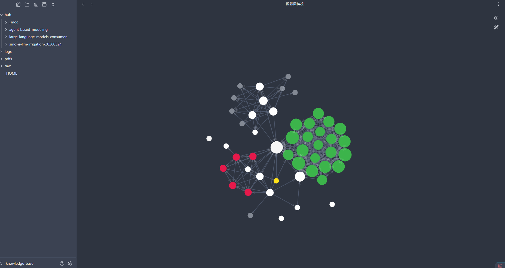

# research-hub

> Zotero + Obsidian + NotebookLM 三合一，專為 AI agent 打造。

[](https://pypi.org/project/research-hub-pipeline/)
[](docs/audit_v0.45.md)
[](pyproject.toml)
[](LICENSE)

English → [README.md](README.md)


---

## 這是什麼

一個 CLI + MCP server,同時做三件事:

1. **Ingest** — 一行指令把學術論文收進 Zotero(引用管理)+ Obsidian(結構化筆記)+ NotebookLM(AI 簡報)。
2. **Organize** — 論文自動分到 cluster、sub-topic,Obsidian graph 按 research label 上色。
3. **Serve** — 提供 **78 個 MCP tools**,讓 Claude Code / Codex / 任何相容 MCP 的 AI 可以直接驅動整個流程(含 v0.42 的 NotebookLM `ask`、v0.43 的 `emit_cluster_base` Bases dashboard 產生器)。

設計給每天都在用 AI agent 的 PhD 學生跟研究團隊,不想在六個分頁之間切來切去的人。

## Source code vs Vault(兩個不同的東西)

research-hub 在你電腦上有兩個分開的位置,這是刻意的設計:

| | Source code (程式碼) | Vault (你的資料庫) |
|---|---|---|
| **是什麼** | Python 套件 + CLI 工具 | 你的研究資料 |
| **在哪裡** | `site-packages/research_hub/`(pip 管理) | `~/knowledge-base/`(預設,`init` 時你自己選) |
| **裡面有** | CLI, MCP server, dashboard 產生器 | 論文筆記, Obsidian graph, crystals, Zotero 同步 |
| **多人共用?** | 是 — 每個人裝同一個 pip package | 否 — 每個人自己的 vault |

`pip install` 之後跑 `research-hub init` 建立你的 vault。如果你已經有 Obsidian vault,`init` 指到那個路徑就好 — research-hub 會把它的資料夾加在你現有筆記旁邊,不會覆蓋。

隨時跑 `research-hub where` 查看你的 config 跟 vault 路徑。

## 跟其他工具的差別

### 1. Crystals — 預先運算好的答案,不是 lazy retrieval (v0.28)

所有 RAG 系統(包括 Karpathy 的 "LLM wiki")都還是在查詢時才把資料拼湊起來。research-hub 的答案是:**儲存 AI 的推理結果,而不是原料**。

對每個 research cluster,你預先讓 AI 回答約 10 個標準問題(用 emit/apply 模式,你可以用任何 LLM),結果存成 crystal 檔案。之後 AI agent 再問「這個領域現在的 SOTA 是什麼?」時,它讀的是預先寫好的 100 字答案 — 而不是 20 篇論文的 abstract。

```bash
research-hub crystal emit --cluster llm-agents-software-engineering > prompt.md
# 把 prompt.md 給 Claude/GPT/Gemini 回答,存成 crystals.json
research-hub crystal apply --cluster llm-agents-software-engineering --scored crystals.json
```

每次 cluster 層級查詢的 token 成本:**~1 KB**(讀 crystal) vs ~30 KB(cluster digest)。**30 倍壓縮**,而且品質不會掉,因為品質在生成時就已經決定了。

[→ 為什麼這不是 RAG(中文版)](docs/anti-rag.zh-TW.md)

### 2. 即時互動 dashboard,可直接執行 (v0.27)

```bash
research-hub serve --dashboard
```

在 `http://127.0.0.1:8765/` 開一個 localhost HTTP dashboard。Manage tab 的每一個按鈕都是**直接執行** CLI 指令,不再只是 copy 到剪貼簿。Vault 有任何變動都透過 Server-Sent Events 推送到瀏覽器。沒開 server 時自動 fallback 到靜態 copy 模式。


### 3. Obsidian graph 自動按 label 上色 (v0.27)

```bash
research-hub vault graph-colors --refresh
```

寫入 14 個顏色群組到 `.obsidian/graph.json`:5 個 cluster 路徑 + 9 個論文 label(`seed`、`core`、`method`、`benchmark`、`survey`、`application`、`tangential`、`deprecated`、`archived`)。每次 `research-hub dashboard` 都會自動刷新。打開 Obsidian Graph View — 你的 vault 是按「意義」視覺化,不是按檔案樹。



### 4. 分 sub-topic 的 Library + citation graph 自動分群 (v0.27)

很大的 cluster(331 篇論文?)不再是扁平清單。它會按 sub-topic 分組、每個可展開。如果你的 cluster 還沒有 sub-topic:

```bash
research-hub clusters analyze --cluster my-big-cluster --split-suggestion
```

用 Semantic Scholar citation graph + networkx community detection,建議 3-8 個有意義的 sub-topic。產出 markdown 報告,你 review 後再執行 `topic apply-assignments`。


---

## 安裝

```bash
pip install research-hub-pipeline
research-hub init              # 互動式設定
research-hub serve --dashboard # 自動開瀏覽器
```

Python 3.10+。**不需要 OpenAI/Anthropic API key** — research-hub 完全 provider-agnostic,所有 AI 生成都走 emit/apply 模式(你把 prompt 給自己的 AI)。

## 給 Claude Code / Claude Desktop 使用者

加到 `claude_desktop_config.json`:

```json
{
  "mcpServers": {
    "research-hub": {
      "command": "research-hub",
      "args": ["serve"]
    }
  }
}
```

然後跟 Claude 講話:

> 「Claude,把 arxiv 2310.06770 加到新的 cluster 叫 LLM-SE」
> 「Claude,幫 LLM-SE cluster 產 crystals」
> 「Claude,這個 cluster 在講什麼?」→ Claude 呼叫 `list_crystals` + `read_crystal` → 拿到預先寫好的 100 字答案

60 個 MCP tools 涵蓋:論文 ingest、cluster CRUD、labels、quotes、draft 組裝、citation graph、NotebookLM、crystal 生成、fit-check、autofill、cluster memory，以及 cluster rebind 工作流。

## 五行指令快速上手

```bash
# 1. 初始化 vault
research-hub init

# 2. Ingest 一篇論文
research-hub add 10.48550/arxiv.2310.06770 --cluster llm-agents

# 3. 開 live dashboard
research-hub serve --dashboard

# 4. 有幾篇論文後,產生 crystals
research-hub crystal emit --cluster llm-agents > prompt.md
# (把 prompt.md 給你的 AI 回答,存成 crystals.json)
research-hub crystal apply --cluster llm-agents --scored crystals.json

# 5. AI 查詢時直接讀 crystals,不用讀論文
# (透過 Claude Desktop MCP,或任何相容 MCP 的 client)
```

## 目前狀態

- **最新版本**: v0.45.0 (2026-04-19) — 詳見 [`CHANGELOG.md`](CHANGELOG.md)
- **測試**: 1520 passing, 15 skipped, 2 xfailed (CI: Linux + Windows + macOS × Python 3.10/3.11/3.12)
- **平台**: Windows, macOS, Linux
- **Python**: 3.10+
- **相依**: `pyzotero`、`pyyaml`、`requests`、`rapidfuzz`、`networkx`、`platformdirs`(都是 pure-Python)
- **選用**: `playwright` extra(NotebookLM 瀏覽器自動化)

## 架構文件

- [MCP tools 參考](docs/mcp-tools.md) — 60 tools 完整列表
- [前 10 分鐘上手](docs/first-10-minutes.md) — 4 個 persona 各自的引導教學
- [Cluster integrity](docs/cluster-integrity.md) — 6 種失敗模式與 4 persona 緩解矩陣
- [Claude Desktop 示範流程](docs/example-claude-mcp-flow.md) — 從 ingest → crystallize → query 的具體例子
- [本地檔案匯入](docs/import-folder.zh-TW.md) — 給 analyst persona 的 import-folder 指南（PDF/DOCX/MD/TXT/URL）
- [Anti-RAG crystals(為什麼不用 RAG)](docs/anti-rag.zh-TW.md) — 繁中完整版
- [升級指南](UPGRADE.md) — 從舊版本升級的注意事項
- [Task-level workflows](docs/task-workflows.md) — v0.33+ 5 個 MCP 包裝器（ask/brief/sync/compose/collect），把 3-4 次呼叫序列收斂成 1 次
- [Screenshot 流程](docs/screenshot-workflow.md) — 用 `dashboard --screenshot` CLI 重拍任何 dashboard tab
- [Audit 報告](docs/) — `audit_v0.26.md` … `audit_v0.33.md`
- [NotebookLM 設定](docs/notebooklm.md) + [疑難排解](docs/notebooklm-troubleshooting.md) — patchright + persistent Chrome (v0.42+)
- [Dashboard 走查](docs/dashboard-walkthrough.md) — tab-by-tab 導覽,含 persona 食譜 (v0.44)
- [v0.43 驗證 log](docs/validation_v0.43.md) — 11 篇 NotebookLM 壓力測 + 雙軌 ask 交叉驗證
- [Papers input schema](docs/papers_input_schema.md) — ingest 管線參考

## 指令速查

| 階段 | 指令 | 用途 |
|---|---|---|
| **初始化** | `init` / `doctor` | 首次設定 + 健康檢查 |
| **搜尋** | `search` / `verify` / `discover new` | 多後端論文搜尋 + DOI 驗證 + AI 評分 |
| **收錄** | `add` / `ingest` | 單篇或批次收錄到 Zotero + Obsidian |
| **整理** | `clusters new/list/show/bind/merge/split/rename/delete` | Cluster CRUD |
| **主題** | `topic scaffold/propose/assign/build` | 從 `subtopics:` frontmatter 生成 sub-topic 筆記 |
| **標籤** | `label` / `find --label` / `paper prune` | 9 值 label 字典(seed/core/method...) |
| **Crystal** | `crystal emit/apply/list/read/check` | 預運算的標準 Q→A 答案 |
| **分析** | `clusters analyze --split-suggestion` | 大 cluster 的 citation graph 自動分群 |
| **同步** | `sync status` / `pipeline repair` | 偵測並修復 Zotero ↔ Obsidian 偏差 |
| **Dashboard** | `dashboard` / `serve --dashboard` / `vault graph-colors` | 靜態 HTML / live HTTP server / Obsidian graph 上色 |
| **NotebookLM** | `notebooklm bundle/upload/generate/download/ask` | 瀏覽器自動化 NLM 流程(v0.42 patchright + persistent Chrome)。`ask` 是 v0.42 新加的即時 Q&A |
| **Obsidian** | `vault polish-markdown` / `bases emit` | v0.42 callout/block-ID 排版升級。v0.43 自動產生 cluster `.base` dashboard(v0.45 起 `ingest`/`topic build` 後自動刷新) |
| **寫作** | `quote` / `compose-draft` / `cite` | 引言擷取、markdown 草稿組裝、BibTeX 匯出 |

## Personas 與安裝指令

| 角色 | 安裝 | 初始化 |
|---|---|---|
| **研究者**（PhD STEM，預設） | `pip install research-hub-pipeline[playwright,secrets]` | `research-hub init` |
| **人文研究者**（重視引文與摘錄，使用 Zotero） | `pip install research-hub-pipeline[playwright,secrets]` | `research-hub init --persona humanities` |
| **分析師**（業界研究，不用 Zotero） | `pip install research-hub-pipeline[import,secrets]` | `research-hub init --persona analyst` |
| **內部知識管理**（實驗室／公司，混合檔案類型） | `pip install research-hub-pipeline[import,secrets]` | `research-hub init --persona internal` |

四種角色共用同一套 dashboard、MCP server、crystal 系統與 cluster integrity 工具。Dashboard 會依 persona 自動調整詞彙並隱藏不相關功能（見 `docs/personas.md`）。

## 給開發者

```bash
git clone https://github.com/WenyuChiou/research-hub.git
cd research-hub
pip install -e '.[dev,playwright]'
python -m pytest -q  # 1520 passing
```

PyPI 套件名稱: **research-hub-pipeline**
CLI 入口: **research-hub**

## License

MIT。見 [LICENSE](LICENSE)。
