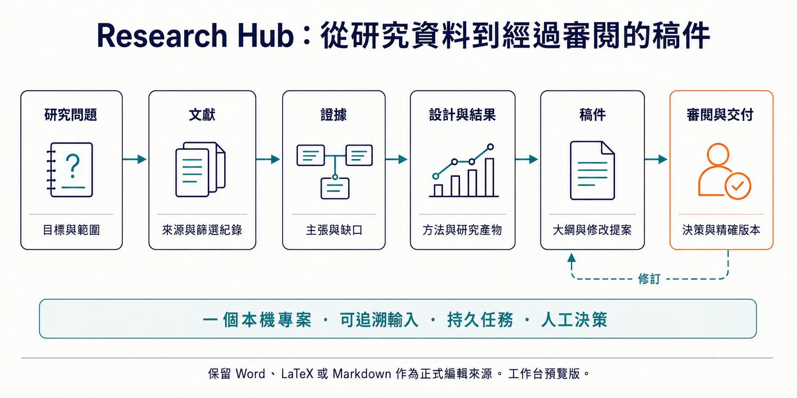
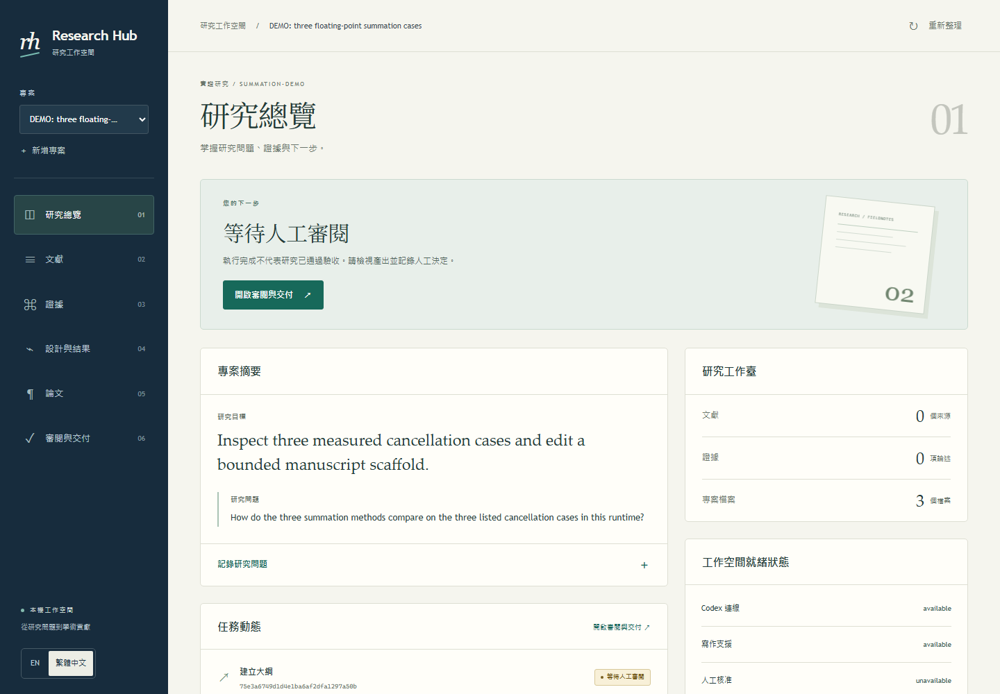
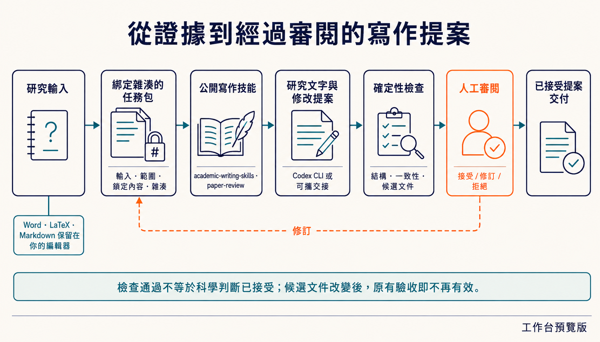

<!-- mcp-name: io.github.WenyuChiou/research-hub -->

# research-hub

以可追溯的工作流程，串連文獻、研究檔案與稿件的本機工作區。

繁體中文 · [English](README.md) · [工作區指南](docs/workspace-guide.zh-TW.md) · [既有功能安裝](docs/setup.md) · [開發者架構](docs/workspace-architecture.md)

[](https://pypi.org/project/research-hub-pipeline/)
[](pyproject.toml)
[](LICENSE)

> **工作區預覽版，尚未發布。** 下方的六頁工作區位於 `codex/researcher-workspace` 分支。PyPI `1.2.0` 不含此功能。請依下方指令安裝分支，或先試用已發布的文獻儀表板。

## 為什麼需要它

研究會跨越檔案與工具：一篇文獻影響研究問題，一次分析改變結果，稿件也需要跟著修訂。當你或 AI 助理接手下一項工作時，這些關係應該仍然清楚可查。



先從本機檔案開始，再視需要連接 Zotero 管理文獻、Obsidian 整理筆記，以及 NotebookLM 製作來源導向的摘要。實證研究與文獻回顧都能使用同一個工作區。

## 在工作區做什麼



| 頁面 | 你的工作 |
|---|---|
| 專案 | 記錄研究問題、目標與專案類型。 |
| 文獻 | 尋找來源，記錄納入或排除的理由。 |
| 證據 | 連結主張與來源，檢視尚未確認的支持關係。 |
| 設計與結果 | 記錄方法、結果、限制與佐證檔案。 |
| 稿件 | 登錄 Word、LaTeX 或 Markdown，準備大綱與修訂。 |
| 審查與交付 | 檢視提案、記錄決定，準備本機交付檔。 |

檔案保留在你選定的工作區。登錄會記下路徑與雜湊值；原始文件仍由你的編輯器修改。

## 如何開始

### 工作區預覽版

需要 Python 3.10+ 與 Git。請選擇**新建或空白的** `workspace-demo` 目錄。

```sh
git clone -b codex/researcher-workspace https://github.com/WenyuChiou/research-hub.git
cd research-hub
python -m pip install -e '.[mcp]'
research-hub project demo --root ./workspace-demo --json
research-hub serve --workspace --root ./workspace-demo
```

開啟[本機工作區](http://127.0.0.1:8765/app/)。示範不需要帳號，包含小型數值加總範例與文獻回顧測試資料。這些是教學輸入，並非模型產生的研究發現。

[工作區指南](docs/workspace-guide.zh-TW.md)說明如何使用自己的檔案、設定寫作功能、交接任務及審查。在依賴預覽版之前，請先查看[附日期的驗證狀態與待完成檢查](docs/workspace-guide.zh-TW.md#verification)。

### 已發布的文獻儀表板

```sh
python -m pip install research-hub-pipeline
research-hub dashboard --sample
```

這個免帳號範例會開啟既有儀表板。要連接實際工具，請參閱[安裝指南](docs/setup.md)、[前十分鐘](docs/first-10-minutes.md)與[儀表板導覽](docs/dashboard-walkthrough.md)。

## 寫作如何進行



| 模式 | 如何運作 |
|---|---|
| 可攜式交接 | 匯出任務給你的 AI 主機，再匯入文字與候選檔案雜湊值。匯出後，任務仍等待代理回覆。 |
| 連接 Codex | 已登入且相容的 Codex CLI 使用你明確信任的公開寫作套件，在不使用工具的模式下產生文字。結果等待人工審查。 |

[公開寫作介接器預覽](https://github.com/WenyuChiou/academic-writing-skills/pull/17)是另一項尚未合併的變更。[請先驗證並明確設定](docs/workspace-guide.zh-TW.md#writing-adapter-preview)；它尚非已發布的相依套件。連接的 Codex 只接收有限長度的文字摘錄，不接收二進位文件內容。Word 格式、LaTeX 編譯及最終文件修改，請在你的編輯器完成。

## 哪些部分可查證

- **可追溯的輸入：** 任務保留輸入版本、結果與決定。已登錄的檔案內容變動後，任務可能過期；工作區會列出需要重新檢視的影響。
- **分開判斷：** 文獻識別碼能解析，不代表它支持某項主張。來源身分、主張支持程度與人工任務接受，各自獨立。
- **明確交付：** 已接受的提案可經另一次核准，打包成本機 ZIP。這不授權投稿或雲端上傳。

本機核准記錄操作者的聲明，不能驗證共用電腦上的個人身分。既有 MCP、儀表板與雲端直接寫入工具，不受工作區核准機制保護。任務完成也不會自動推進工作流程的八個階段。詳見[邊界與復原指南](docs/workspace-guide.zh-TW.md#boundaries-and-recovery)。

<details>
<summary>既有整合、憑證與疑難排解</summary>

<a id="start-here"></a>
<a id="first-run-checklist"></a>

依[安裝指南](docs/setup.md)選擇整合，再執行 `research-hub doctor`。NotebookLM 需要在可見瀏覽器中登入 Google；最近記錄的認證嘗試失敗，尚未重新驗證。在你自行檢查成功之前，請視為功能降級／未檢查。詳見 [NotebookLM 設定](docs/notebooklm.md)與[疑難排解](docs/notebooklm-troubleshooting.md)。

| 既有人物設定 | 選用安裝額外項目 |
|---|---|
| Researcher（研究者） | `[playwright,secrets]` |
| Humanities（人文研究） | `[playwright,secrets]` |
| Analyst（分析人員） | `[import,secrets]` |
| Internal KM（內部知識管理） | `[import,secrets]` |

<a id="credential-reference"></a>

以下憑證用於既有整合；本機工作區示範不需要任何憑證。

<!-- env-vars-table-start -->

| Name | Required | Purpose |
|---|---|---|
| `ZOTERO_API_KEY` | 僅 Zotero | Zotero API 認證 |
| `ZOTERO_LIBRARY_ID` | 僅 Zotero | Zotero 文獻庫識別碼 |
| `SEMANTIC_SCHOLAR_API_KEY` | 否 | 選用搜尋 API 金鑰 |
| `SEMANTIC_SCHOLAR_RPS` | 否 | 選用搜尋請求速率設定 |
| `TAVILY_API_KEY` | 否 | 選用網頁搜尋後端 |
| `BRAVE_API_KEY` | 否 | 選用網頁搜尋後端 |

<!-- env-vars-table-end -->

<a id="connect-your-ai-host"></a>

透過 [MCP／REST](docs/ai-integrations.md)連接 AI、查看 [AI 主機支援表](docs/ai-host-support.md)，或使用[本機檔案匯入](docs/import-folder.zh-TW.md)。[CLI 參考](docs/cli-reference.md)、[EZproxy 指南](docs/ezproxy.md)與[實際操作檢查表](docs/live-smoke.md)提供詳細操作說明。

</details>

## 開發者連結

[工作區架構](docs/workspace-architecture.md)說明任務帳本與核准邊界。技術細節見[工作流程執行機制](docs/workflow-runtime.md)、[MCP 工具](docs/mcp-tools.md)、[穩定 API](docs/stable-api.md)、[檔案格式](docs/file-formats.md)及 [OpenWiki](openwiki/quickstart.md)。目前清單可用 `python -m research_hub describe --filter mcp_tools` 與 `--filter skills` 查詢。

既有儀表板素材仍可查看：[MCP 流程圖](docs/images/research-hub-cover.png)、[儀表板操作錄影](docs/images/dashboard-walkthrough.gif)與[完整解析度影片](docs/demo/dashboard-walkthrough.mp4)。

[參與開發](CONTRIBUTING.md) · [版本紀錄](CHANGELOG.md) · [發布流程](docs/RELEASING.md) · [MIT 授權](LICENSE)
