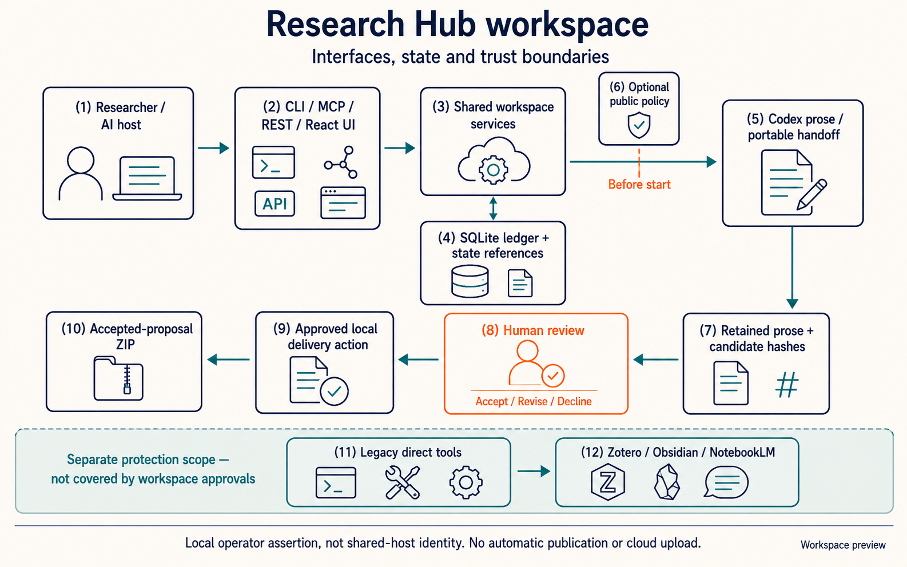
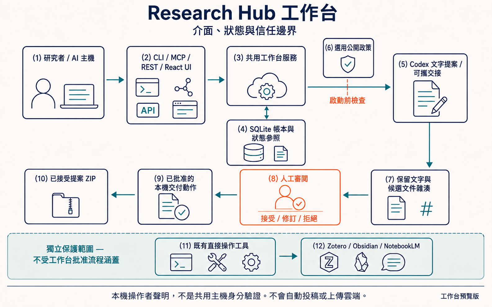
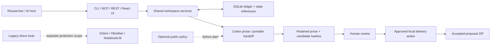

# Workspace architecture for agent/harness builders

Research Hub is a **Vertical AI Research Reference Harness** at the domain layer:
it links research inputs, proposal execution, review decisions, and exact local
handoffs. It complements host runtimes and editors; it is not a general agent
runtime, experiment platform, or publication-approval service.





## Authoritative semantic source

The diagrams are Image 2 concept illustrations, not screenshots. These Mermaid
edges and the bilingual [label map](workspace-visuals.json) are the maintainable
semantic source. Review image arrows against them after every regeneration.
The [visual provenance record](workspace-visual-provenance.json) binds reviewed
concept illustrations and actual UI captures to exact asset hashes.
Dashed lines mean an optional check or an explicitly separate legacy path.



## One service across interfaces

`workspace/service.py` dispatches explicit project, manuscript, task, and action
operations. CLI and the four `workspace_*` MCP tools call that same service.
`workspace/server.py` maps REST resources to it; it does not unwrap MCP functions.
Use `research-hub <resource> --help` for the implemented operations.

| Resource | REST entry points | CLI / MCP |
|---|---|---|
| Project | `GET /api/v1/workspace`, `POST /api/v1/projects`, `GET /api/v1/projects/{id}` | `project`, `workspace_project` |
| Demo | `POST /api/v1/workspace/demo` on an empty root | `project demo`, `workspace_project(operation="demo")` |
| Manuscript | `POST /api/v1/projects/{id}/bind`, `/audit`, `/impact` | `manuscript`, `workspace_manuscript` |
| Task | `POST /api/v1/projects/{id}/tasks`, `GET /api/v1/tasks/{id}`, `POST /api/v1/tasks/{id}/{operation}` | `task`, `workspace_task` |
| Delivery | `POST /api/v1/projects/{id}/delivery`, `GET /api/v1/actions/{id}`, `POST /api/v1/actions/{id}/{operation}` | `action`, `workspace_action` |

REST task operations are `run`, `handoff`, `result`, `decision`, `cancel`, and
`recover`; action operations are `decision`, `execute`, and `reconcile`.
All mutations require the local page's CSRF token. Decision endpoints additionally
require an explicitly enabled operator session. Agent MCP calls cannot supply an
in-process human capability through JSON.

## Three distinct state authorities

| Owner | Location within selected root | Responsibility |
|---|---|---|
| Workspace ledger | `.research/workspace.sqlite3` | Projects, registered artifact revisions, evidence records, tasks, decisions, local actions and receipts |
| Existing workflow runtime | `.research/projects/{id}/workflow_state.yml` | Workflow stages and configured policy/checkpoint references |
| Public writing skill | `.research/projects/{id}/manuscript_state.json` | Manuscript authority, semantic locks, argument alignment and release-check contract |

The ledger references the other states; it does not create copies of their rules.
Task completion does **not** advance the workflow's eight stages. The current
workspace proposal ZIP does **not** satisfy the writing skill's release contract.
Use its five required release checks and explicit authorization separately.

Registration hashes original files without rewriting them. Superseded registrations
remain in history. A task freezes active artifact hashes, evidence records, the
configured adapter hash, and manuscript-state bytes. Acceptance and delivery check
those inputs again. Stale binding is reported rather than silently rewriting state.
Impact reports are conservative review prompts, not semantic synchronization.

## Execution, recovery, and trust

The first connected adapter produces **no-tool prose proposals**. It checks Codex
CLI isolation flags and authentication, disables tool features and web search,
uses an empty temporary working directory, and supplies bounded text excerpts.
It disables automatic skill instruction injection and project-document loading
for that empty worker context, retaining native sandbox/rule enforcement. Only
the configured public writing materials are supplied by Hub. The settings are
validated with `--strict-config`; unsupported clients fail closed. See the
[official Codex configuration schema](https://github.com/openai/codex/blob/main/codex-rs/core/config.schema.json).
Binary Word/PDF content is not visible to it. Handoff packets can instead be used
by a separate host; exporting a packet never marks work complete.

Raw prose and event records are retained before event validation. Invalid streams,
tool activity, nonzero exits, timeouts, and cancellation remain non-success.
Windows child processes enter a nested kill-on-close Job Object before launch;
normal shutdown waits for descendant termination before temporary-file cleanup.
there is no breakaway or unprotected fallback. POSIX supervision monitors parent
liveness and kills the owned process group. This is process lifetime management,
not a new security sandbox. The host's native sandbox and account permissions remain
the security boundary. See [Microsoft Job Objects](https://learn.microsoft.com/en-us/windows/win32/procthread/job-objects).

An interrupted task stays `running` in the ledger until explicit recovery.
Recovery refuses a still-live owner; a dead owner's task becomes `blocked`, never
automatically rerun. Inspect retained files before importing a recovered result.
Cancelled and declined tasks do not resume into success. A revised proposal needs
a new input hash and another decision.
Each connected revision has its own execution directory and candidate path;
prior prose, event logs and decision receipts are retained.

The local delivery action commits `pending_external_action` **before** exclusive
ZIP creation. A retry does not repeat the write. `reconcile` verifies exact bytes
and records a receipt, or reports a blocker if the file is absent/partial/changed.
Existing Zotero, Obsidian and NotebookLM tools remain a separate protection scope.
They do not inherit workspace approval simply by appearing in the same application.

## Local security boundary

`serve --workspace` binds only `127.0.0.1`. Host and Origin checks, CSRF protection,
security headers, bounded request bodies, and local static assets are independent
of the legacy dashboard. No private workspace file-download endpoint is exposed.
Do not reverse-proxy this preview to the public internet or use it as a multi-user
service. Local decision sessions are operator assertions, **not identity
authentication against other users or processes on the same computer**.

An explicitly selected writing bundle is trusted executable code. Its versioned
manifest detects drift; self-declared hashes do not authenticate a publisher.
The public producer is currently [PR #17](https://github.com/WenyuChiou/academic-writing-skills/pull/17),
not a permanent unpublished dependency. No private host paths or hydrology-specific
rules are discovered automatically. Configured policy without an available engine
fails closed. Unconfigured external harness remains optional.

Public manuscript state lists editable manuscript, supplement and response
documents. Research code, data, figures and tables remain authority sources and
frozen task inputs; prose audits do not certify these as scientific evidence.
Existing binding changes require explicit alignment review, not silent rewriting.

## Reproduce the checks

```sh
python -m pytest -q tests/test_workspace_runtime.py tests/test_workspace_actions.py tests/test_workspace_executor.py tests/test_workspace_demo.py --timeout=90
cd web
npm ci
npm test
npm run build
cd ..
python -m pip install playwright==1.58.0
python -m playwright install chromium
python scripts/workspace_browser_smoke.py --output ./browser-evidence
```

The browser smoke uses a real local server and demo database. Its imported prose
is explicitly a transport fixture, not model output or a human-approved paper.
It writes screenshots, a trace, and a report to the selected output directory.
See the [researcher guide](workspace-guide.md#verification) for dated scope and
remaining live-provider/human checks. Build assets ship inside the Python wheel;
Node is needed for UI development, not to run an installed workspace.
